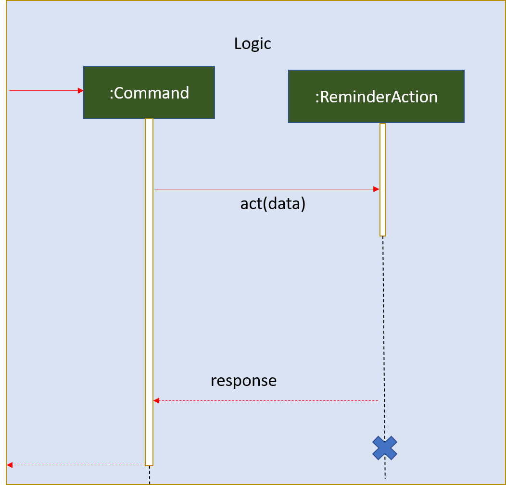
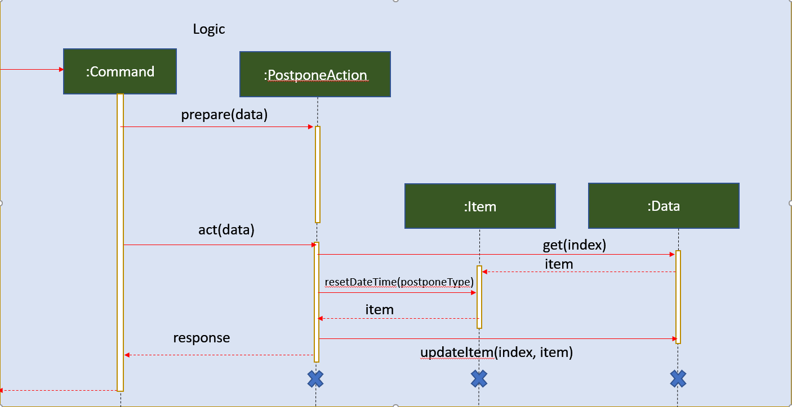

# Developer Guide

## Design
The Architecture Diagram below represents a high-level design overview of the App. Specifically, it is done with an n-tier architectural style, where the higher layers make use of services provided by lower layers. 

**Main** 
For the main layer, it contains a single class known as *Duke*. 
Main's interaction with Storage 
When the app launches, Duke loads any previous data from storage and then connects the components of the app in sequence. Upon shutting down,  Duke calls upon method to save user's data automatically.  

Main's interaction with UI 
Main gets user input and displays messages through the use of UI component. 

Main's interaction with Command Interpreter 
Upon receiving command from the UI, Duke would pass the entire user input into Command Interpreter (CI)

Main's interaction with Execute 
Once CI processed the user input, duke proceeds to redirect the input to Execute for execution of action. 

**UI** 
The UI layer entails the package *visualize*, which contains classes *ColoredString*, *Bitmap*, *UI*, *Cli*, 
*FancyCli* and enumerations *Color* and *Sprite* in the following structure:

UI's interaction with user 
UI gets user input through *nextline()*, and renders strings as a user-comprehensible interface through 
*update(String, Data)*.

UI's interaction with the rest of the program 
UI passes the user's input string out to the Duke object, which then passes the string to the Command Interpreter layer.
UI also reads data from the Data object for refreshing purposes, but does not modify it.

**Command Interpreter** 
**Executer** 
**Storage** 

## Implementation 
[add ur individual features here]

### module planner feature

The module planner feature entails many *Actions* which extend `Action`. Their functionalities and usages
are in the table below:

|Table|To|Be|Filled|
|-----|---|---|------|
|blah|blah|blah|blah|

A typical flow of execution would be:
1. blah
1. blah
1. blah

### CAP calculator feature

The proposed undo/redo mechanism is facilitated by `CalculateCapAction`. It extends `Action` to execute command given by the user, output are then passed on to `Ui` for display. 
Additionally, it implements the following operations:

* `CalculateCapAction#act()` - Calculate the user CAP based on stored user grades / input modules.
* `CalculateCapAction#prepare()` - Parse user command to suitable parameter for `CalculateCapAction#act()` function.

Given below is an example usage scenario and how thecap calculator mechanism behaves at each step.

Step 1. The user executes `cap` command find his current CAP grade. Command is then parsed by `CalculateCapAction#prepare()` to be passed as arguments for `CalculateCapAction#act()`.

Step 2. `CalculateCapAction#act()` retrieves data from the stored user's grades.

Step 3. `CalculateCapAction#act()` then retrieves module data from the `modulelist.txt` to determine Modular Credit (MC) allocation.

Step 4. CAP value is calculated and returned to the user through `Ui`.

The following activity diagram summarizes what happens when a user executes a new command:

### Reminder Feature

The proposed undo/redo mechanism is facilitated by `ReminderAction`. It extends `Action` and the output is passed onto `UI` for display. Additionally, it implements the following operations:

* `ReminderAction#act()` — List out the deadlines and events tasks that are due within 3 days

Given below is an example usage scenario and how the reminder mechanism behaves at each step.

Step 1. The user executes `reminder` command to list out tasks due within 3 days. Command is then parsed by `ReminderAction#act()`.

Step 2. `ReminderAction#act` retrieves tasklist data from the user's list

Step 3. `ReminderAction#act` then sorts the due dates in ascending order

Step 4: Tasks due within 3 days are returned to the user through Ui

The following sequence diagram diagram shows how the reminder operation works

### Postpone Feature

The proposed undo/redo mechanism is facilitated by `PostponeAction`. It extends `Action` to execute command given by the user, output are then passed on to `Ui` for display. 
Additionally, it implements the following operations:

* `PostponeAction#act()` - Postpone the deadline or event task by the chosen parameter.
* `PostponeAction#prepare()` - Parse user command to suitable parameter for `PostponeAction#act()` function.

Given below is an example usage scenario and how thecap calculator mechanism behaves at each step.

Step 1. The user executes `postpone [index]` command to postpone the targeted task. Command is then parsed by `PostponeAction#prepare()` to be passed as arguments for `PostponeAction#act()`.

Step 2. `PostponeAction#act()` re-sets the date of the targeted task from the stored user's tasks by default a day.

Step 3. `PostponeAction#act()` then updates the stored user's data.

Step 4. Postponed target task is returned to the user through `Ui`.

The following activity diagram summarizes what happens when a user executes a new command:

These operations are exposed in the Model interface as Model#commitAddressBook(), Model#undoAddressBook() and Model#redoAddressBook() respectively.

## Product scope
### Target user profile

{Describe the target user profile}

### Value proposition

{Describe the value proposition: what problem does it solve?}

## User Stories

|Version| As a ... | I want to ... | So that I can ...|
|--------|----------|---------------|------------------|
|v1.0|new user|see usage instructions|refer to them when I forget how to use the application|
|v2.0|user|find a to-do item by name|locate a to-do without having to go through the entire list|

## Non-Functional Requirements

{Give non-functional requirements}

## Glossary

* *glossary item* - Definition

## Instructions for manual testing

{Give instructions on how to do a manual product testing e.g., how to load sample data to be used for testing}
