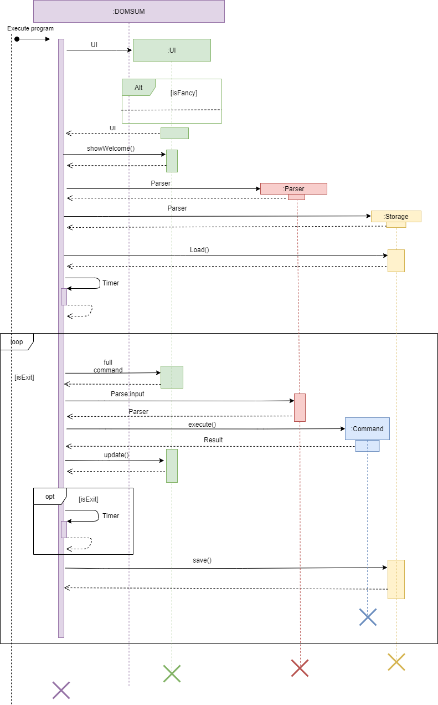
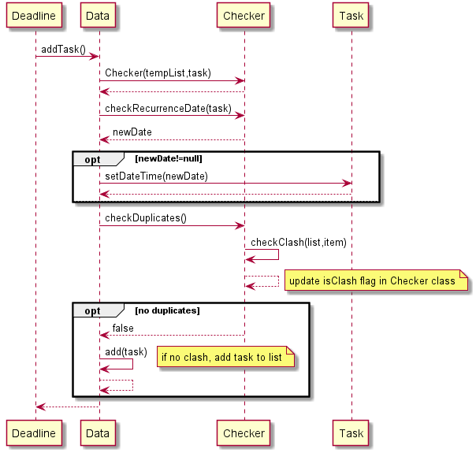
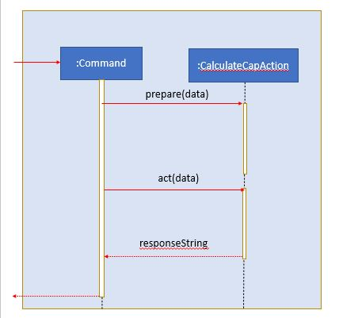

# Developer Guide

## 1. Table of content
**1. Table of content**\
**2. Setting Up**\
**3. Design**\
&nbsp;&nbsp;&nbsp;3.1 Architecture\
&nbsp;&nbsp;&nbsp;3.2 Main Layer\
&nbsp;&nbsp;&nbsp;3.3 UI Layer\
&nbsp;&nbsp;&nbsp;3.4 Command Interpreter Layer\
&nbsp;&nbsp;&nbsp;3.5 Executor Layer\
&nbsp;&nbsp;&nbsp;3.6 Storage Layer\
**4. Implementation**\
&nbsp;&nbsp;&nbsp;4.1 Module Planner Feature\
&nbsp;&nbsp;&nbsp;4.2 Checker Feature\
&nbsp;&nbsp;&nbsp;4.3 Cap Caculator Feature\
&nbsp;&nbsp;&nbsp;4.4 Reminder Feature\
&nbsp;&nbsp;&nbsp;4.5 Postpone Feature\
**5. Appendix A Product Scope**\
**6. Appendix B User Stories** \
**7. Appendix C Use Cases** \
**8. Appendix D Non-funcitonal Requirements** \
**9. Appendix E Glossary** \
**10. Appendix F. Instruction for Manual Testing**

## 2. Setting Up

1.  Ensure that you have Java 11 or above installed.
2.  Download the latest version of  `Duke`  from  [Our Release Page](https://github.com/AY2021S1-CS2113-T13-2/tp/releases/tag/v1.0).
3.  Copy the file to the folder you want to use as the home folder for your Mobile Nusmod.
4.  Open the Command Prompt if you are running on Windows or Terminal if you are running on Mac OS.
5.  Navigate to your home folder and type ‘java -jar domnus.jar’
6.  Type ‘bye’ to terminate your session.

## 3. Design

### 3.1 Architecture
The **Architecture Diagram** below represents a high-level design overview of the App. Specifically, it is done with an **N-tier architectural style**, where the higher layers make use of services provided by lower layers. 

**3.2 Main Layer** 
For the `main` layer, it contains a single class known as `Duke`. 

**3.3 UI Layer** 
Main gets user input and displays messages through the use of UI component. 
The UI layer entails the package *visualize*, which contains classes *ColoredString*, *Bitmap*, *UI*, *Cli*, 
*FancyCli* and enumerations *Color* and *Sprite* in the following structure:

UI's interaction with user 
UI gets user input through *nextline()*, and renders strings as a user-comprehensible interface through 
*update(String, Data)*.

UI's interaction with the rest of the program 
UI passes the user's input string out to the Duke object, which then passes the string to the Command Interpreter layer.
UI also reads data from the Data object for refreshing purposes, but does not modify it. 

**1.3 Command Interpreter Layer** 
Upon receiving command from the UI, Duke would pass the entire user input into Command Interpreter (CI)

**1.4 Execute Layer** 
Once CI processed the user input, duke proceeds to redirect the input to Execute for execution of action. 

**1.5 Storage Layer** 
Once CI processed the user input, duke proceeds to redirect the input to Execute for execution of action. 

**1.6 Flow of DOMSUN** 
The sequence diagram below shows the main interaction of classes with each other throughout the whole lifecycle of DOMSUM.

## 4. Implementation 
This section highlights some of our project's key feature and its implementation. 

### 4.1 Module Planner Feature

The module planner feature entails many *Actions* which extend `Action`. Their functionalities and usages
are in the table below:

|Table|To|Be|Filled|
|-----|---|---|------|
|blah|blah|blah|blah|

A typical flow of execution would be:
1. blah
1. blah
1. blah

### 4.2 Checker Feature 

The checker mechanism is facilitated by the utility class `Checker`. It is an independent class on its own without extensions and is stored under the `Data` package of our app. The class implements the following operations: 

 - `checkDuplicates()`- Calls the checkClash method and return the status of boolean variable `isClash` .
 - `checkClash(ArrayList< item >, Item)`- Updates `isClash` once a duplicate item is found in the list.
 - `checkRecurrenceDate(Task)` - Checks if the current date is beyond the stated date in the list, and provides a new update for the date recurring date.

Given below is an example usage scenario and how the checker mechanism behaves at each step. 

Step 1. A new `Deadline` object is created and needs to be added to the existing list of task. Hence it calls `addTask()` method under `Data` class. 

Step 2. Data instantiates a Checker with its existing list by calling its constructor, and the task to be added to the list 

Step 3. Data proceeds to call the `checkRecurrenceDate(Task)` of the Checker class, to get a newDate if today's date is beyond the stated weekly date.
 
Step 4. If `newDate` is not `null`it shows that there is a new updated date. Therefore, we proceed to update the object with our updated weekly date. 

Step 5. Now we proceed to call `checkDuplicates()` of Checker class. 

Step 6. If `false` , there is no duplicates in the existing list, and the task can be safely added. Otherwise, no action will be taken. 

### 4.3 CAP calculator feature

The proposed undo/redo mechanism is facilitated by `CalculateCapAction`. It extends `Action` to execute command given by the user, output are then passed on to `Ui` for display. 
Additionally, it implements the following operations:

* `CalculateCapAction#act()` - Calculate the user CAP based on stored user grades / input modules.
* `CalculateCapAction#prepare()` - Parse user command to suitable parameter for `CalculateCapAction#act()` function.

Given below is an example usage scenario and how thecap calculator mechanism behaves at each step.

Step 1. The user executes `cap` command find his current CAP grade. Command is then parsed by `CalculateCapAction#prepare()` to be passed as arguments for `CalculateCapAction#act()`.

Step 2. `CalculateCapAction#act()` retrieves data from the stored user's grades.

Step 3. `CalculateCapAction#act()` then retrieves module data from the `modulelist.txt` to determine Modular Credit (MC) allocation.

Step 4. CAP value is calculated and returned to the user through `Ui`.

The following activity diagram summarizes what happens when a user executes a new command:

### 4.4 Reminder Feature

The proposed reminder mechanism is facilitated by `ReminderAction`. It extends `Action` and the output is passed onto `UI` for display. Additionally, it implements the following operations:

* `ReminderAction#act()` — List out the deadlines and events tasks that are due within 3 days

Given below is an example usage scenario and how the reminder mechanism behaves at each step.

Step 1. The user executes `reminder` command to list out tasks due within 3 days. Command is then parsed by `ReminderAction#act()`.

Step 2. `ReminderAction#act` retrieves tasklist data from the user's list

Step 3. `ReminderAction#act` then sorts the due dates in ascending order

Step 4: Tasks due within 3 days are returned to the user through Ui

The following sequence diagram diagram shows how the reminder operation works

### 4.5 Remind Feature

Another proposed manual reminder mechanism is facilitated by `RemindAction`. It extends `Action` to execute command given by the user, output are then passed on to `Ui` for display. 
Additionally, it implements the following operations:

* `RemindAction#act()` - Set the reminder to be executed on the chosen time.
* `RemindAction#prepare()` - Parse user command to suitable parameter for `RemindAction#act()` function.
* `RemindAction#getSchedule` - Returns the schedule set by the user.

Given below is an example usage scenario and how the remind mechanism behaves at each step.

Step 1. The user executes `remind [time]` command to set schedule for the reminder. Command is then parsed by `RemindAction#prepare()` to be passed as arguments for `RemindAction#act()`.

Step 2. `RemindAction#act()` calls `RemindAction#getSchedule` to pass the schedule later in `Ui`.

Step 3. The schedule is returned to the user through `Ui`.

The following activity diagram summarizes what happens when a user executes a new command:

### 4.6 Snooze Feature

The proposed snooze mechanism is facilitated by `SnoozeAction`. It extends `Action` to execute command given by the user, output are then passed on to `Ui` for display. 
Additionally, it implements the following operations:

* `RemindAction#getNewInterval` - Returns the new interval set by the user.

Given below is an example usage scenario and how the snooze mechanism behaves at each step.

Step 1. The user executes `snooze` command to snooze for the reminder. 

Step 2. `SnoozeAction#getNewInterval` sets and returns the new interval.

Step 3. The new interval is returned to the user through `Ui`.

The following activity diagram summarizes what happens when a user executes a new command:

### 4.7 Postpone Feature

The proposed undo/redo mechanism is facilitated by `PostponeAction`. It extends `Action` to execute command given by the user, output are then passed on to `Ui` for display. 
Additionally, it implements the following operations:

* `PostponeAction#act()` - Postpone the deadline or event task by the chosen parameter.
* `PostponeAction#prepare()` - Parse user command to suitable parameter for `PostponeAction#act()` function.

Given below is an example usage scenario and how the postpone mechanism behaves at each step.

Step 1. The user executes `postpone [index]` command to postpone the targeted task. Command is then parsed by `PostponeAction#prepare()` to be passed as arguments for `PostponeAction#act()`.

Step 2. `PostponeAction#act()` re-sets the date of the targeted task from the stored user's tasks by default a day.

Step 3. `PostponeAction#act()` then updates the stored user's data.

Step 4. Postponed target task is returned to the user through `Ui`.

The following activity diagram summarizes what happens when a user executes a new command:

### 4.8 Focus Feature

The proposed focus mechanism is facilitated by `FocusAction`. It extends `Action` to execute command given by the user, output are then passed on to `Ui` for display. 
Additionally, it implements the following operations:

* `FocusAction#act()` - Sets the task flag by the chosen parameter.
* `FocusAction#prepare()` - Parse user command to suitable parameter for `PostponeAction#act()` function.

Given below is an example usage scenario and how the focus mechanism behaves at each step.

Step 1. The user executes `focus [task type]` command to filter based on task type. Command is then parsed by `FocusAction#prepare()` to be passed as arguments for `FocusAction#act()`.

Step 2. `FocusAction#act()` then sets flag in the data.

Step 3. Changed context is returned to inform the user through `Ui`.

The following activity diagram summarizes what happens when a user executes a new command:

These operations are exposed in the Model interface as Model#commitAddressBook(), Model#undoAddressBook() and Model#redoAddressBook() respectively.
## Appendix A. Product scope
### Target user profile

 - has a need to manage significant number of schedules 
 - prefer desktop apps over other types 
 - can type fast
 - prefers typing to mouse interactions 
 - is reasonably comfortable using CLI apps 

### Value proposition
All in one app to track tasks and their dates, monitor productivity and calculate cap. 

## Appendix B. User Stories

|Priority| As a ... | I want to ... | So that I can ...|
|--------|----------|---------------|------------------|
| *** |Student before start of semester|List the modules MC|Follow the recommended MC |
| *** |Student before start of semester|List of module available|Easily Choose which modules to take|
| ** |Student before start of semester|Find the modules either by keyword, module code or even MC |Easily see the desired modules |
| ** |Student before start of semester|Select the modules but not taking it yet |Easily whether the MC fits my requirement |
| *  |Student before start of semester|Find out the etails of the Module|To find out more about the modules.|
| *** |Student before start of semester|Take the desired modules|Mark the modules that i want to take as taken  |
| *** |Student during the semester|Add tasks such as todo,deadline and event into my list|Easily keep track of all the task i have to complete  |
| ** |Student during the semester|Have a Reminder of which deadline is due soon|Ensure that no task is missed out  |
| *** |Student during the semester|Add task to modules |Easily know which tasks belongs to which modules  |
| *** |Student during the semester|Delete task once they are completed |Remove unnecessary task on the list |
| ** |Student after the semester|Calculate the CAP of my individual modules|Easily find out my performance this semester |
| * |Student after the semester|Clear the list of tasks and modules|Start afresh for the next semester |

{More to be added}
## Appendix C. Use Cases: 
This section describes the Use Cases for some of the features implemented in DOMNUS. 

**Use Case: Taking a module 
MSS:** 

 1. User requests to list all modules 
 2. DOMNUS shows a list of modules 
 3. User requests to mark a specific module as 'taken' 
 4. DOMNUS marks the module as taken

Use case ends. 
**Extensions** \
&nbsp;&nbsp;&nbsp;3a. The module given is invalid\
&nbsp;&nbsp;&nbsp;&nbsp;&nbsp;3a.1Use case shows `[NOT FOUND]` message
&nbsp;&nbsp;&nbsp;&nbsp;&nbsp;Use case resumes at step 3\
&nbsp;&nbsp;&nbsp;3b. User adds in the wrong module \
&nbsp;&nbsp;&nbsp;&nbsp;&nbsp;3b.1The `untake` command can be used to untake the taken module

**Use Case: List MC**
**MSS:**

 1. User requests to list total MC on the current list.
 2. DOMNUS shows the total MC of the current list. Default list is entire modules list.

Use case ends.  
**Extensions** 

&nbsp;&nbsp;&nbsp;1a. User not focusing on the correct list \
&nbsp;&nbsp;&nbsp;&nbsp;&nbsp;1a1. DOMNUS shows the entire module list total MC instead of the 'taken' list MC

 
Use Case: 

## Appendix D. Non-Functional Requirements

1.  Should work on any  _mainstream OS_  as long as it has Java  `11`  or above installed.
2.  Should be able to hold up to 1000 persons without a noticeable sluggishness in performance for typical usage.
3.  A user with above average typing speed for regular English text (i.e. not code, not system admin commands) should be able to accomplish most of the tasks faster using commands than using the mouse.

_{More to be added}_

## Appendix E. Glossary

 - N-tier Architectural Style 
	 - In the n-tier style, high layers make use of services provided by lower layers. Lower layers are independent of higher layers. 
 - Mainstream OS: Windows, Linux, Unix, OS-X
 - Private contact detail 

## Appendix F. Instructions for manual testing

1. Launch and Shutdown 
Step 1: Download the latest version of  `Duke`  from  [Our Release Page](https://github.com/AY2021S1-CS2113-T13-2/tp/releases/tag/v1.0).\
Step 2: Copy the file to the folder you want to use as the home folder for your Mobile Nusmod.\
Step 3: Open the Command Prompt if you are running on Windows or Terminal if you are running on Mac OS.\
Step 4: Navigate to your home folder and type  **‘java -jar domnus.jar’**

1. Launch and Shutdown 
Step 1: Download the latest version of  `Duke`  from  [Our Release Page](https://github.com/AY2021S1-CS2113-T13-2/tp/releases/tag/v1.0).\
Step 2: Copy the file to the folder you want to use as the home folder for your Mobile Nusmod.\
Step 3: Open the Command Prompt if you are running on Windows or Terminal if you are running on Mac OS.\
Step 4: Navigate to your home folder and type  **‘java -jar domnus.jar’**

2. Switching between Fancy and CLI 
Test case: `fancy` 
Expected: Switches to fancy mode of display  
Test case: `plain` 
Expected: Switches to plain mode of display 
Test case: `Fancy` ,`Plain` 
Expected: Error message due to cap sensitive.  
3. Focusing between different list
	Test case: `focus mod`/`task`/`todo`/`deadline`/`event`/`selected`/`taken` 
			   Expected : Shows the current list you are focused on. No list will be shown.  
	Test case: `focus taken`  
	Expected: Shows the current list of modules you have taken.  
	Other incorrect focus commands to try: `focus 0` , `focus what?`, ... (focus on non-existent list)  
	Expected : Error message due to invalid command.  
	
4. List Modules/Task
Test case: `focus mod` -> `list` 
	Expected: Shows the list of modules.  
	Test case: `focus task` -> `list`  
	Expected: Shows the current list of task.  
	
5. Find Modules 
Test case: `focus mod` -> `find Engin` 
Expected: Shows the list of available modules with keyword 'Engin'  
Test case:  `focus mod` -> `find 2113` 
Expected: Shows the list of modules with keyword '2113' 
Test case: `focus task`-> find deadline  
Expected: Show list of deadline modules 

 6. Details of Modules 
 Test cases: `detail CS2113` 
 Expected: Shows Module code, name, mc, and description.  
Test cases: `detail 1` 
Expected: Shows the information of the 1st task based on the current list focused on.  
Test cases: `detail xyz` No detail of such item is found.  
7. Take Modules 
Test cases: `focus mod` -> `take 1 2`  
Expected: Takes the 1st and 2nd module on the module list. 
Test cases: `focus task` -> `take 1 2`  
Expected: Task is not module, therefore it cannot be taken. 
Test cases: `focus mod` -> `take CS2113`  
Expected: Mark CS2113 as taken. 
Test cases: `focus mod` -> `take cs2113` 
Expected: Module not found as inputs are case sensitive.  
7. Reminder  
Test cases: `reminder ` 
Expected: Shows task that are due within 3 days.  

8. Cap Calculation  
Test cases: `cap -m CS2113 A+ EE2026 B CS1010 B- 
Expected: Shows you the calculated cap.  
