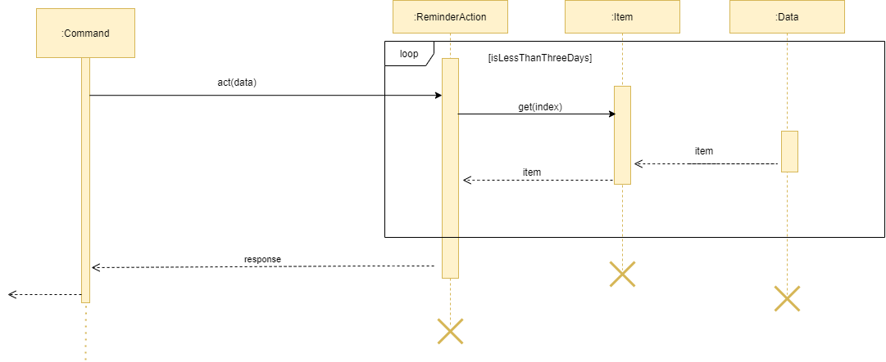

# Developer Guide

## 1. Table of content
**1. Table of content**\
**2. Introduction**\
**3. Setting Up**\
**4. Design**\
&nbsp;&nbsp;&nbsp;4.1 Architecture\
&nbsp;&nbsp;&nbsp;4.2 Main Layer\
&nbsp;&nbsp;&nbsp;4.3 UI Layer\
&nbsp;&nbsp;&nbsp;4.4 Command Interpreter Layer\
&nbsp;&nbsp;&nbsp;4.5 Executor Layer\
&nbsp;&nbsp;&nbsp;4.6 Storage Layer\
&nbsp;&nbsp;&nbsp;4.7 Flow of DOMSUN\
**5. Implementation**\
&nbsp;&nbsp;&nbsp;5.1 Module Planner Feature\
&nbsp;&nbsp;&nbsp;5.2 Checker Feature\
&nbsp;&nbsp;&nbsp;5.3 Cap Caculator Feature\
&nbsp;&nbsp;&nbsp;5.4 Reminder Feature\
&nbsp;&nbsp;&nbsp;5.5 Postpone Feature\
**6. Appendix A Product Scope**\
**7. Appendix B User Stories** \
**8. Appendix C Use Cases** \
**9. Appendix D Non-funcitonal Requirements** \
**10. Appendix E Glossary** \
**11. Appendix F. Instruction for Manual Testing**

## 2. Introduction
Domsun is a CLI program that allows users to manage tasks and modules. <br>
Users will be able to browse and select modules, create and arrange tasks, add tasks to modules,<br>
create reminders and calculate their MCs / CAPs.

## 3. Setting Up
1. **Configure Intellij for JDK 11**, as described [here](https://se-education.org/guides/tutorials/intellijJdk.html).
1. **Import the project _as a Gradle project_**, as described [here](https://se-education.org/guides/tutorials/intellijImportGradleProject.html).
1. **Verify the set up**: After the importing is complete, locate the `src/main/java/seedu/duke/Domnus.java` file, right-click it, and choose `Run Domnus.main()`. If the setup is correct, you should see something like the below:
   ```

    > Task :compileJava UP-TO-DATE
    > Task :processResources UP-TO-DATE
    > Task :classes UP-TO-DATE
    
    > Task :Domnus.main()
    	____________________________________________________________
    		Hello, I'm Domnus. What can I do for you?
    	____________________________________________________________
    	____________________________________________________________
    		Here are the tasks due within 3 days: 
    		No task within 3 days from now
    	____________________________________________________________

   ```
   
 Type  `bye` to ensure there is no error saving or creating a new file when exiting. Re-launch and type `help` for all commands available in the program. 

## 4. Design

### 4.1 Architecture
The **Architecture Diagram** below represents a high-level design overview of the App. Specifically, it is done with an N-tier architectural style, where the higher layers make use of services provided by lower layers. 


As shown in the above diagram, user only interacts with the UI layer and their commands, in turn will be passed to next adjacent layer. Given below is a quick overview of each component. 

**4.2 Main Layer**<br>
The `main` layer, it contains a single class known as `Domnus`. Its purpose can be split into 3 parts: 

At Start Up: It calls upon the `storage` component to load user's past data and it also loads the complete module list that is packaged inside the JAR file. <br>
At Operating: It connects the relevant component of the program to ensure the program is operating as per the intended logic flow. <br>
At Shutdown: It exits the running loop of the program to shutdown the program successfully. <br>

**4.3 UI Layer**<br>
Main gets user input and displays messages through the use of UI component. 
The UI layer entails the package *visualize*, which contains classes *ColoredString*, *Bitmap*, *UI*, *Cli*, 
*FancyCli* and enumerations *Color* and *Sprite* in the following structure:


UI's interaction with user<br>
UI gets user input through *nextline()*, and renders strings as a user-comprehensible interface through 
*update(String, Data)*.

UI's interaction with the rest of the program<br>
UI passes the user's input string out to the DOMNUS object, which then passes the string to the Command Interpreter layer.
UI also reads data from the Data object for refreshing purposes, but does not modify it. 

**4.4 Command Interpreter Layer**<br>
Upon receiving command from the UI, DOMNUS would pass the entire user input into Command Interpreter (CI)

**4.5 Execute Layer**<br>
The `Execute` layer carries out the relevant actions required based on the analyzed input. All of the features in the program are stored under this layer which is under the package name `command`. To summarize, this layer is responsible for: 

1) Match the user's command to the relevant actions.
2) Throw any exception based on errorneous user input/invalid conditions. 

**4.6 Storage Layer**<br>
The `Storage` layer loads, saves, and do pre-data processing before performing the two aforementioned action. It is active in 2 phases. 

During loading phase: 
1) For the user's task: This layer translates the previously (if any) saved data format into recognizable commands and loads these data as per how the app functions during runtime. 
2) For the module list: This layer conducts simple parsing of the text file containing all the modules and stores them creates individual item known as `SingleModule` before loading them into an arraylist. 

During saving phase: 
1) For the user's task: This layer saves any changes that the user made to the task list onto a text file. 
2) For the module list: This layer saves any module marked `TAKEN` by the user onto a text file, together with the relevant module information such as module's code, and grade attained (if any).  

**4.7 Flow of DOMSUN**<br>
The sequence diagram below shows the main interaction of classes with each other throughout the whole lifecycle of DOMSUM.


## 5. Implementation<br>
This section highlights some of our project's key feature and its implementation. 

### 5.1 Take Feature
The take mechanism is facilitated by the `TakeAction` class and is extensively used by other classes via inheritance. 
The take mechanism does the following: Comprehends user input and generate target identifiers, 
filters the targets from data, and performs the specified operations on the targets. 
The `TakeAction` class extends `Action` class, 
and internally it stores an arraylist of `Item` object in `targetBackup` field to restore the disruptions to the 
`data` object. Additionally, it implements the following operation: 

 - `prepare()` - Interpret the `ParamNode` arguments and creates target identifiers for the `act()` function. 
 In `TakeAction` the identifiers are `ArrayList` objects, `codes` and `indices`. 
 - `act()`- Get the target items from `data` based on identifiers, do `modifyObject()` on each target, and return a 
 `String` as the execution result for this action.
 - `modifyObject()` - Performs the actual operation of modifying the target item. In `TakeAction`, it assigns the 
 `isTaken` field of the target item as `true`.
 - `getObjectInfo()` - Controls what is the text representation of the target object in the return string.
 - `safetyCheck()`- Sets the `isBlind` flag if user's input has a void parameter tree, thereby specifying the default 
 mode of action for this command. 
 - `superAct()` - Returns `super.Act()`. Used as the break out node in the prototype chain for the inherited classes 
 to be able to call the method `Act()` of the ancestor. In child classes of `TakeAction`, this method can be overloaded
 to return `super.superAct()` to start the upward propogation.
 - `superPrepare()` - Returns `super.Prepare()`. Used as the break out node in the prototype chain for the inherited 
 classes to be able to call the method `Prepare()` of the ancestor. In child classes of `TakeAction`, this method can 
 be overloaded to return `super.superPrepare()` to start the upward propogation.

Given below is an example usage scenario and how the take mechanism behaves at each step. 

Step 1. The user enters `take 1 2 CS2113`. Once the execute layer (`Command` object) executes the message and calls 
`action.prepare()`, `TakeAction` will begin its `prepare()` operation.

Step 2. `prepare()` calls its prototype and extracts information from the `ParamNode` tree.

Step 3. `prepare()` checks if the command has a void parameter tree. If so, it calls the `safetyCheck()` method to 
 perform the default operation (sets the `isBlind` flag and ensure that the `act()` will execute in the `blind` 
 mode in this case). Otherwise, it parses the user parameters into `codes` or `indices` depending on 
 the most probable interpretations, and throws a custom exception `CommandException` object in case of exceptions.
 In this case, `1` and `2` will be added to `indices` and `CS2113` will be added to `codes`.

Step 4. Next, execute layer will call `action.act()` which causes `TakeAction` to begin its `act()` operation.

Step 5. `act()` stores the current state of the `data` object into its `flag` field and `targetBackup` field to prevent 
unwanted changes to the `data` object.

Step 6. `act()` enters either the `blind` mode or the `normal` mode depending on the value of `isBlind`.

Step 7. If in `blind` mode, `act()` filters out all items in `data` by using the `blindSearch` flag. 
In this case this flag is set to `Constants.SELECTED` to search through all selected items. In the children classes
of `TakeAction`, however, this variable may be reset to other values to have different blind search behaviours. 
Otherwise, in `normal` mode, `act()` filters out items from `data` based on identifiers, 
in this case `codes` and `indices`.

Step 8. `act()` loops through all filtered items and calls `modifyObject()` on each of them.

Step 9. `modidyObject()` modifies the objects of interest, in this case by setting the `isTaken` field to true.

Step 10. Depending on the result of `modifyObject()`, `act()` parses the suitable string for output through the use of 
a `StringBuilder` object, in the process calling `getObjectInfo()` to get the textual descriptions of the targets.

Step 11. `act()` restores the previous state to the `data` object using the `flag` field and the `targetBackup` field.

Step 12. `act()` replaces the string `Constants.TEXT_PLACEHOLDER` in the default output string for TakeAction 
defined in `Constants.messageMap` with the actual result string, and returns it.

**Design consideration:**

1. Reuseable - functions such as `modyfiObject()` can be overloaded in child classes to achieve different functions.
1. Low coupling - `prepare()` is not aware of the program `data`, and `act()` is not aware of the user input.
1. Uniform - `TakeAction` as well as all other actions have uniform input and outputs, and can be mapped 
indescriminatively to any `Command` object and executed indifferently.

**Aspect : How TakeAction executes**
 - **Alternative 1 (current choice):** calls `getTarget()` method of `data` object using different flags 
 to get wanted targets.
    - Pros: Easy to implement and easy to read. Easily extendable by adding more flags in the `getTarget()` method.
    - Cons: Slow. Everytime we `act()` on something, the `data` object needs to do the filtering again.
 - **Alternative 2:** Have many different lists or maps, each stores one category of data
    - Pros: Fast, no need filtering in most cases.
    - Cons: Harder to implement and extend. Everytime we want a new functionality we would need to create a new list.

### 5.2 Statistic Feature 
The statistic feature is facilitated by the StatsAction class. It extends `Action` class, and it functions under the architectural component `execute`. Internally, it stores an arraylist of Item object in `targetList`. This class implements the following operation: 

 - `prepare()` - Sets `isMod` flag according to user's 
 - `act()`- Gets `targetList` and calculates the raw ratio of the completed items.
 - `roundedRatioBar()`- Returns a rounded ratio enclosed in square brackets for printing. 

Given below is an example usage scenario and how the statistic mechanism behaves at each step. 

Step 1. The user enters `stats -mod CS2113`	once the execute layer executes the message and calls `action.prepare()` class, `StatsAction` will begin its `prepare()` operation

Step 2. `prepare()` looks at the input called `ParamNode args` which is user command processed by Command Intepreter layer, and starts to identify whether user has enter the keyword `mod ` if `userInput` contains the keyword, then `isMod` flag will be set. 

Step 3. Next, execute layer will call `action.act()` which causes StatsAction to begin its `act()` operation. If `isMod` flag is set, `act()` will search for the user specified module and get the list of tasks tagged to it.

Step 5. Once the list of task is obtain, the operation will loop through the task list and count the number of completed task followed by generating a ratio. 

Step 6. This ratio will be passed into `roundedRatioBar` to return *String* of a rounded ratio to 1 decimal place enclosing it in square brackets. 

Step 7. Now `StatsAction` is completed and it will return this string back to `Command` to store it under the String variable `result`. The `Main` layer will retrieve `result`, before passing it onto `UI` layer for printing. 


**Design consideration:**

**Aspect : How statistics executes**
 - **Alternative 1 (current choice):** Create a separate class and get list of tasks/taken modules' task and scan through them to calculate statistics
	 - Pros: Reduces Coupling and increase testability as a software unit itself. 
	 - Cons: May have performance issues in terms of memory usage 

 - **Alternative 2:** initialize statistics as zero and each task contains an aspect called statistics
	 - Pros: Will use less memory since the task itself will be deleted. 
	 - Cons: Stats will be updated constantly even though we do not need it. 

### 5.3 CAP calculator feature

This feature extends `Action` to execute command given by the user, output are then passed on to `Ui` for display. 
Additionally, it implements the following operations:

* `CalculateCapAction#act()` - Calculate the user CAP based on stored user grades / input modules.
* `CalculateCapAction#prepare()` - Parse user command to suitable parameter for `CalculateCapAction#act()` function.

Given below is an example usage scenario and how thecap calculator mechanism behaves at each step.

Step 1. The user executes `cap` command find his current CAP grade. Command is then parsed by `CalculateCapAction#prepare()` to be passed as arguments for `CalculateCapAction#act()`.

Step 2. `CalculateCapAction#act()` retrieves data from the stored user's grades.

Step 3. `CalculateCapAction#act()` then retrieves module data from the `modulelist.txt` to determine Modular Credit (MC) allocation.

Step 4. CAP value is calculated and returned to the user through `Ui`.

The following activity diagram summarizes what happens when a user executes a new command:


### 5.4 Reminder Feature

The proposed reminder mechanism is facilitated by `ReminderAction`. It extends `Action` and the output is passed onto `UI` for display. Additionally, it implements the following operations:

* `ReminderAction#act()`- List out the deadlines and events tasks that are due within 3 days

Given below is an example usage scenario and how the reminder mechanism behaves at each step.

Step 1. The user executes `reminder` command to list out tasks due within 3 days. Command is then parsed by `ReminderAction#act()`.

Step 2. `ReminderAction#act` retrieves tasklist data from the user's list

Step 3. `ReminderAction#act` then sorts the due dates in ascending order

Step 4: Tasks due within 3 days are returned to the user through Ui

The following sequence diagram diagram shows how the reminder operation works



### 5.5 Remind Feature

Another proposed manual reminder mechanism is facilitated by `RemindAction`. It extends `Action` to execute command given by the user, output are then passed on to `Ui` for display. 
Additionally, it implements the following operations:

* `RemindAction#act()` - Set the reminder to be executed on the chosen time.
* `RemindAction#prepare()` - Parse user command to suitable parameter for `RemindAction#act()` function.
* `RemindAction#getSchedule` - Returns the schedule set by the user.

Given below is an example usage scenario and how the remind mechanism behaves at each step.

Step 1. The user executes `remind [time]` command to set schedule for the reminder. Command is then parsed by `RemindAction#prepare()` to be passed as arguments for `RemindAction#act()`.

Step 2. `RemindAction#act()` calls `RemindAction#getSchedule` to pass the schedule later in `Ui`.

Step 3. The schedule is returned to the user through `Ui`.

The following activity diagram summarizes what happens when a user executes a new command:


### 5.6 Snooze Feature

The proposed snooze mechanism is facilitated by `SnoozeAction`. It extends `Action` to execute command given by the user, output are then passed on to `Ui` for display. 
Additionally, it implements the following operations:

* `RemindAction#getNewInterval` - Returns the new interval set by the user.

Given below is an example usage scenario and how the snooze mechanism behaves at each step.

Step 1. The user executes `snooze` command to snooze for the reminder. 

Step 2. `SnoozeAction#getNewInterval` sets and returns the new interval.

Step 3. The new interval is returned to the user through `Ui`.

The following activity diagram summarizes what happens when a user executes a new command:


### 5.8 Postpone Feature

The proposed undo/redo mechanism is facilitated by `PostponeAction`. It extends `Action` to execute command given by the user, output are then passed on to `Ui` for display. 
Additionally, it implements the following operations:

* `PostponeAction#act()` - Postpone the deadline or event task by the chosen parameter.
* `PostponeAction#prepare()` - Parse user command to suitable parameter for `PostponeAction#act()` function.

Given below is an example usage scenario and how the postpone mechanism behaves at each step.

Step 1. The user executes `postpone [index]` command to postpone the targeted task. Command is then parsed by `PostponeAction#prepare()` to be passed as arguments for `PostponeAction#act()`.

Step 2. `PostponeAction#act()` re-sets the date of the targeted task from the stored user's tasks by default a day.

Step 3. `PostponeAction#act()` then updates the stored user's data.

Step 4. Postponed target task is returned to the user through `Ui`.

The following activity diagram summarizes what happens when a user executes a new command:


### 5.7 Grade feature

This extends `TakeAction` to register modules as `isTaken` from `moduleList.txt`, output are then passed on to `Ui` for display. 
Additionally, it implements the following operations:

* `GradeAction#act()` - Calculate the user CAP based on stored user grades / input modules.
* `GradeAction#prepare()` - Parse user command to suitable parameter for `GradeAction#act()` function.

Given below is an example usage scenario and how the grade feature mechanism behaves at each step.

Step 1. The user executes `grade GER1000 A-` command find his current CAP grade. Command is then parsed by `GradeAction#prepare()` to be passed as arguments for `GradeAction#act()`.

Step 2. `GradeAction#act()` takes in data prepared by `GradeAction#prepare()`.

Step 3. `GradeAction#act()` then retrieves module data from the `modulelist.txt` to determine module details.

Step 4. Grade is attributed to the corresponding modules and response message is returned to the user through `Ui`.

The following activity diagram summarizes what happens when a user executes a new command:


### 5.8 Focus Feature

The proposed focus mechanism is facilitated by `FocusAction`. It extends `Action` to execute command given by the user, output are then passed on to `Ui` for display. 
Additionally, it implements the following operations:

* `FocusAction#act()` - Sets the task flag by the chosen parameter.
* `FocusAction#prepare()` - Parse user command to suitable parameter for `PostponeAction#act()` function.

Given below is an example usage scenario and how the focus mechanism behaves at each step.

Step 1. The user executes `focus [task type]` command to filter based on task type. Command is then parsed by `FocusAction#prepare()` to be passed as arguments for `FocusAction#act()`.

Step 2. `FocusAction#act()` then sets flag in the data.

Step 3. Changed context is returned to inform the user through `Ui`.

The following activity diagram summarizes what happens when a user executes a new command:


## Appendix A. Product scope
### Target user profile

 - has a need to manage significant number of schedules 
 - prefer desktop apps over other types 
 - can type fast
 - prefers typing to mouse interactions 
 - is reasonably comfortable using CLI apps 

### Value proposition
All in one app to track tasks and their dates, monitor productivity and calculate cap. 

## Appendix B. User Stories

|Priority| As a ... | I want to ... | So that I can ...|
|--------|----------|---------------|------------------|
| *** |Student before start of semester|List the modules MC|Follow the recommended MC |
| *** |Student before start of semester|List of module available|Easily Choose which modules to take|
| ** |Student before start of semester|Find the modules either by keyword, module code or even MC |Easily see the desired modules |
| ** |Student before start of semester|Select the modules but not taking it yet |Easily whether the MC fits my requirement |
| *  |Student before start of semester|Find out the etails of the Module|To find out more about the modules.|
| *** |Student before start of semester|Take the desired modules|Mark the modules that i want to take as taken  |
| *** |Student during the semester|Add tasks such as todo,deadline and event into my list|Easily keep track of all the task i have to complete  |
| ** |Student during the semester|Have a Reminder of which deadline is due soon|Ensure that no task is missed out  |
| *** |Student during the semester|Add task to modules |Easily know which tasks belongs to which modules  |
| *** |Student during the semester|Delete task once they are completed |Remove unnecessary task on the list |
| ** |Student after the semester|Calculate the CAP of my individual modules|Easily find out my performance this semester |
| * |Student after the semester|Clear the list of tasks and modules|Start afresh for the next semester |

{More to be added}
## Appendix C. Use Cases: 
This section describes the Use Cases for some of the features implemented in DOMNUS. 

**Use Case: Taking a module 
MSS:** 

 1. User requests to list all modules 
 2. DOMNUS shows a list of modules 
 3. User requests to mark a specific module as 'taken' 
 4. DOMNUS marks the module as taken

Use case ends.<br>
**Extensions** \
&nbsp;&nbsp;&nbsp;3a. The module given is invalid\
&nbsp;&nbsp;&nbsp;&nbsp;&nbsp;3a.1Use case shows `[NOT FOUND]` message
&nbsp;&nbsp;&nbsp;&nbsp;&nbsp;Use case resumes at step 3\
&nbsp;&nbsp;&nbsp;3b. User adds in the wrong module \
&nbsp;&nbsp;&nbsp;&nbsp;&nbsp;3b.1The `untake` command can be used to untake the taken module

**Use Case: List MC**
**MSS:**


 1. User requests to list total MC on the current list.
 2. DOMNUS shows the total MC of the current list. Default list is entire modules list.

Use case ends.<br> 
**Extensions** 

&nbsp;&nbsp;&nbsp;1a. User not focusing on the correct list \
&nbsp;&nbsp;&nbsp;&nbsp;&nbsp;1a1. DOMNUS shows the entire module list total MC instead of the 'taken' list MC


## Appendix D. Non-Functional Requirements

1.  Should work on any  _mainstream OS_  as long as it has Java  `11`  or above installed.
2.  Should be able to hold up to 1000 persons without a noticeable sluggishness in performance for typical usage.
3.  A user with above average typing speed for regular English text (i.e. not code, not system admin commands) should be able to accomplish most of the tasks faster using commands than using the mouse.

_{More to be added}_

## Appendix E. Glossary

 - N-tier Architectural Style 
	 - In the n-tier style, high layers make use of services provided by lower layers. Lower layers are independent of higher layers. 
 - Mainstream OS: Windows, Linux, Unix, OS-X
 - Private contact detail 

## Appendix F. Instructions for manual testing

1. Launch and Shutdown 
Step 1: Download the latest version of  `DOMNUS`  from  [Our Release Page](https://github.com/AY2021S1-CS2113-T13-2/tp/releases/tag/v1.0).\
Step 2: Copy the file to the folder you want to use as the home folder for your Mobile Nusmod.\
Step 3: Open the Command Prompt if you are running on Windows or Terminal if you are running on Mac OS.\
Step 4: Navigate to your home folder and type  **‘java -jar domnus.jar’**

2. Switching between Fancy and CLI 
Test case: `fancy`<br>
Expected: Switches to fancy mode of display <br>
Test case: `plain`<br>
Expected: Switches to plain mode of display<br>
Test case: `Fancy` ,`Plain`<br>
Expected: Error message due to cap sensitive. <br>
3. Focusing between different list
Test case: `focus mod`/`task`/`todo`/`deadline`/`event`/`selected`/`taken`<br>
           Expected : Shows the current list you are focused on. No list will be shown. <br>
Test case: `focus taken` <br>
Expected: Shows the current list of modules you have taken. <br>
Other incorrect focus commands to try: `focus 0` , `focus what?`, ... (focus on non-existent list) <br>
Expected : Error message due to invalid command. <br>
	
4. List Modules/Task
Test case: `focus mod` -> `list`<br>
Expected: Shows the list of modules. <br>
Test case: `focus task` -> `list` <br>
Expected: Shows the current list of task. <br>
	
5. Find Modules 
Test case: `focus mod` -> `find Engin`<br>
Expected: Shows the list of available modules with keyword 'Engin' <br>
Test case:  `focus mod` -> `find 2113`<br>
Expected: Shows the list of modules with keyword '2113'<br>
Test case: `focus task`-> find deadline <br>
Expected: Show list of deadline modules 

6. Details of Modules 
Test cases: `detail CS2113`<br>
Expected: Shows Module code, name, mc, and description. <br>
Test cases: `detail 1`<br>
Expected: Shows the information of the 1st task based on the current list focused on. <br>
Test cases: `detail xyz` No detail of such item is found. <br>

7. Take Modules 
Test cases: `focus mod` -> `take 1 2` <br>
Expected: Takes the 1st and 2nd module on the module list.<br>
Test cases: `focus task` -> `take 1 2` <br>
Expected: Task is not module, therefore it cannot be taken.<br>
Test cases: `focus mod` -> `take CS2113` <br>
Expected: Mark CS2113 as taken.<br>
Test cases: `focus mod` -> `take cs2113`<br>
Expected: Module not found as inputs are case sensitive. <br>

8. Reminder <br>
Test cases: `reminder `<br>
Expected: Shows task that are due within 3 days. <br>

9. Cap Calculation <br>
Test cases: `cap`<br>
Expected: Shows you the calculated cap from stored useer data. <br>
Test cases: `cap -m CS2113 A+ EE2026 B CS1010 B-`<br>
Expected: Shows you the calculated cap from given input modules. <br>
