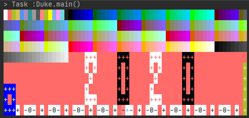

# Domnus - An easy way to track your schedules!



 - This is a desktop tasks tracker application. It comes with a fancy and plain mode of display in which user can switch anytime between them.
 - It is a Java application intended for students to track their modules, mc, daily task, as well as assignments for the individual modules. 

## Setting up in Intellij

Prerequisites: JDK 11 (use the exact version), update Intellij to the most recent version.

1. **Configure Intellij for JDK 11**, as described [here](https://se-education.org/guides/tutorials/intellijJdk.html).
1. **Import the project _as a Gradle project_**, as described [here](https://se-education.org/guides/tutorials/intellijImportGradleProject.html).
1. **Verify the set up**: After the importing is complete, locate the `src/main/java/seedu/duke/Duke.java` file, right-click it, and choose `Run Duke.main()`. If the setup is correct, you should see something like the below:
   ```
   > Task :compileJava
   > Task :processResources NO-SOURCE
   > Task :classes
   
   > Task :Duke.main()
   Hello from
    ____        _        
   |  _ \ _   _| | _____ 
   | | | | | | | |/ / _ \
   | |_| | |_| |   <  __/
   |____/ \__,_|_|\_\___|
   
   What is your name?
   ```
   Type some word and press enter to let the execution proceed to the end.

## Build automation using Gradle

* This project uses Gradle for build automation and dependency management. It includes a basic build script as well (i.e. the `build.gradle` file).
* If you are new to Gradle, refer to the [Gradle Tutorial at se-education.org/guides](https://se-education.org/guides/tutorials/gradle.html).

## Testing

### I/O redirection tests

* To run _I/O redirection_ tests (aka _Text UI tests_), navigate to the `text-ui-test` and run the `runtest(.bat/.sh)` script.

### JUnit tests

* A skeleton JUnit test (`src/test/java/seedu/duke/DukeTest.java`) is provided with this project template. 
* If you are new to JUnit, refer to the [JUnit Tutorial at se-education.org/guides](https://se-education.org/guides/tutorials/junit.html).

## Checkstyle

* A sample CheckStyle rule configuration is provided in this project.
* If you are new to Checkstyle, refer to the [Checkstyle Tutorial at se-education.org/guides](https://se-education.org/guides/tutorials/checkstyle.html).

## CI using GitHub Actions

The project uses [GitHub actions](https://github.com/features/actions) for CI. When you push a commit to this repo or PR against it, GitHub actions will run automatically to build and verify the code as updated by the commit/PR.

## Documentation

`/docs` folder contains a skeleton version of the project documentation.

Steps for publishing documentation to the public: 
1. If you are using this project template for an individual project, go your fork on GitHub.<br>
   If you are using this project template for a team project, go to the team fork on GitHub.
2. Click on the `settings` tab.
3. Scroll down to the `GitHub Pages` section.
4. Set the `source` as `master branch /docs folder`.
5. Optionally, use the `choose a theme` button to choose a theme for your documentation.


## Site Map

* [User Guide](https://github.com/AY2021S1-CS2113-T13-2/tp/blob/master/docs/UserGuide.md)
* [Developer Guide](https://github.com/AY2021S1-CS2113-T13-2/tp/blob/master/docs/DeveloperGuide.md)
* [About Us](https://github.com/AY2021S1-CS2113-T13-2/tp/blob/master/docs/AboutUs.md)
* [Contact Us](https://github.com/AY2021S1-CS2113-T13-2/tp/blob/master/docs/ContactUs.md)
