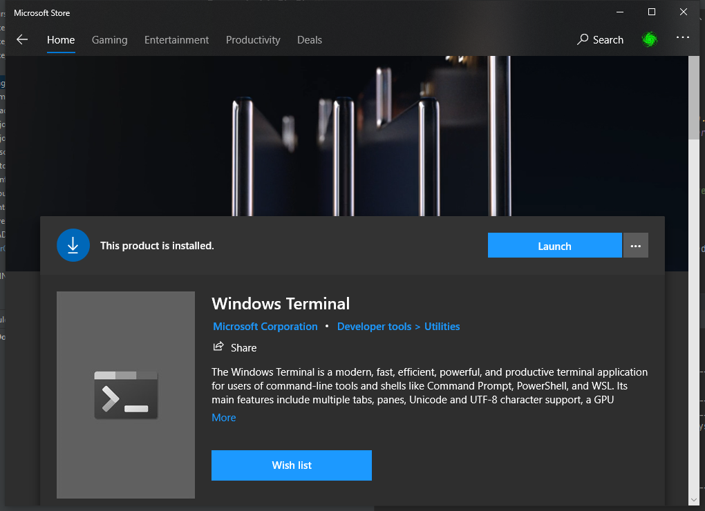
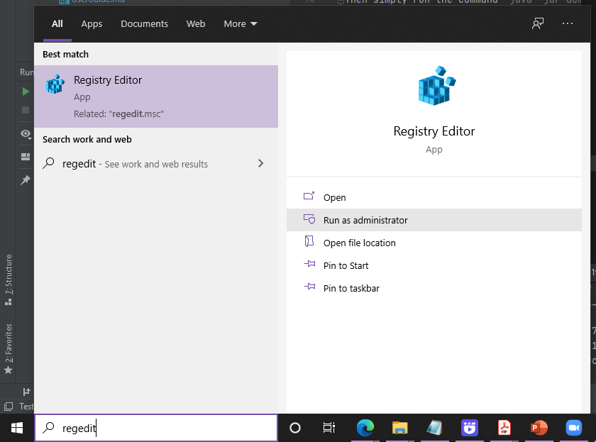
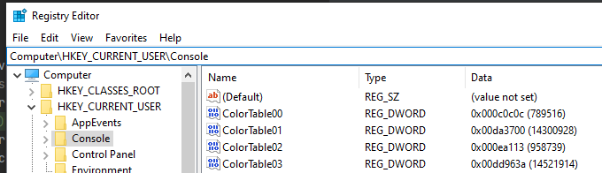
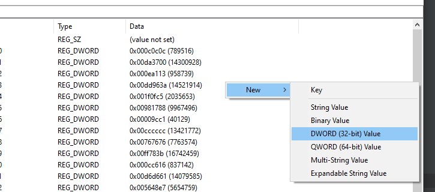
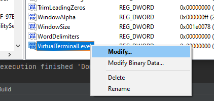
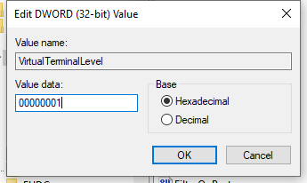
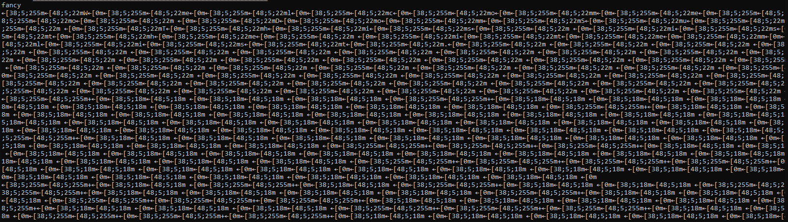
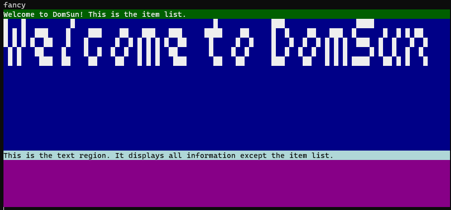
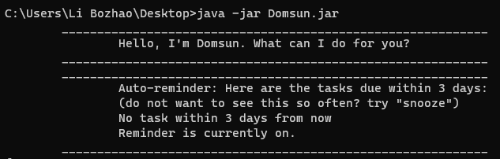

# User Guide

## Introduction

Domsun is a **Desktop Command Line Interface (CLI) program that allows users to manage tasks and modules.** <br>
Domsun is targeted at busy NUS students who want to manage their tasks and modules well to achieve their dream CAP. <br>
Users will be able to browse and select modules, create and arrange tasks, add tasks to modules,<br>
create reminders, calculate and set goals for their MCs / CAPs.

## Contents
- [Preliminaries](#preliminaries)
  * [Installation](#installation)
  * [Running the program](#running-the-program)
  * [Domsun Tutorial](#domsun-tutorial)
- [Features](#features)
- [Command Summary](#command-summary)
    * [`Daily Tasks`](#daily-tasks)
    * [`Module Planner`](#module-planner)
    * [`General Features`](#general-features)
- [Usage](#usage)
    * [`Daily Tasks`](#todo---add-a-to-do-to-the-task-list)
        * [`todo` - Add a todo to the task list](#todo---add-a-to-do-to-the-task-list)
        * [`deadline` - Add a deadline to the task list](#deadline---add-a-deadline-to-the-task-list)
        * [`event` - Add an event to the task list](#event---add-an-event-to-the-task-list)
        * [`list` - Print a list of added tasks](#list---print-a-list-of-added-tasks)
        * [`done` - Mark a task as done](#done---mark-a-task-as-done)
        * [`undone` - Mark a task as undone](#undone---mark-a-task-as-undone)
        * [`find` - Find an event in the task list](#find---find-an-event-in-the-task-list)
        * [`postpone` - Postpone a task to a later date](#postpone---postpone-a-task-by-index)
        * [`reminder` - Print tasks that are due soon](#reminder---print-tasks-that-are-due-soon)
        * [`snooze` - Delays reminder popup](#snooze---delays-reminder-popup)
    * [`Module Planner`](#take---take-module)
        * [`take` - Take module(s)](#take---take-module)
        * [`untake` - Untake module(s)](#untake---untake-module)
        * [`sel` - Select items by index](#sel---select-items-by-index)
        * [`unsel` - Unselect items](#unsel---unselect-items)
        * [`detail` - Prints item detail](#detail---prints-item-detail)
        * [`grade` - Add grade to course or module](#grade---add-grade-to-course-or-module)
        * [`goal` - Calculate how far the user is from his/her target CAP](#goal---calculate-how-far-the-user-is-from-his-or-her-target-cap)  
        * [`mc` - Prints MCs](#mc---prints-mcs)
        * [`cap` - Prints CAPs](#cap---prints-caps)
    * [`General Features`](#add---add-task-to-module)
        * [`add` - Add task(s) to module(s)](#add---add-task-to-module)
        * [`clear` - Clear the task list](#clear---clear-the-task-list)
        * [`delete` - Delete a task from the task list](#delete---delete-a-task-from-the-task-list)
        * [`edit` - Modify attributes of an item](#edit---modify-attributes-of-an-item)
        * [`focus` - Change the context of the program](#focus---change-the-context-of-the-program)
        * [`load` - Loads linked tasks](#load---loads-linked-tasks) 
        * [`stats` - Prints Statistics](#stats---prints-statistics)
        * [`help` - Print help text of the commands](#help---print-help-text-of-the-commands)
        * [`fancy` - Switch the UI to the fancy mode (GUI-like CLI)](#fancy---switch-the-ui-to-the-fancy-mode)
        * [`plain` - Switch the UI to the plain mode (pure-text CLI)](#plain---switch-the-ui-to-the-plain-mode)
        * [`next` - Switch the target region to the next page ***(GUI mode only)***](#next---switch-the-target-region-to-the-next-page)
        * [`prev` - Switch the target region to the previous page ***(GUI mode only)***](#prev---switch-the-target-region-to-the-previous-page)
        * [`unknown` - Prints error message](#unknown---prints-error-message)
        * [`bye` - Quit the program](#bye---quit-the-program)
- [Triggering the syntax reminder](#triggering-the-syntax-reminder)
- [FAQ](#faq)

## Preliminaries

### Installation

1. Ensure that you have Java 11 or above installed.
2. Download the latest version of `Domsun` from [Our Release Page](https://github.com/AY2021S1-CS2113-T13-2/tp/releases).
3. If you are on Mac or Linux platforms, please ignore Step 4 to Step 6. 
4. If you are on Windows platform, we recommend using ***Windows Terminal*** instead of cmd.exe:<br>

<br>If you do not have Windows Terminal, try it out! It is fast and powerful, and enables the full features
of ANSI text rendering by default, which our Domsun will be utilising.
5. If you insist on using `cmd.exe` as your terminal on Windows, it also works, but you need 
 some extra work by doing the following steps:
    - Type `regedit` in your Search box, and click `Run as Administrator`:<br>
    
    <br>You can use other methods
    to open your registry editor as well.
    - Locate `Computer\HKEY_CURRENT_USER\Console`:<br>
    
    - Create a new `DWORD` entry in the registry table (right click on the right) named `VirtualTerminalLevel` 
    if it is not present yet:<br>
    
    - Right click on the value you have just created, and click on **`Modify`**:<br>
    
    - Modify the value to be `00000001`:<br>
    
6. Restart your cmd.exe by closing all cmd windows and re-open cmd.
    - *What did you just do?*
        1. You just enabled programs opened through cmd.exe to inherit ANSI rendering options from cmd.exe, which
        is by default off. (The ANSI rendering for cmd.exe itself is by default ***on***.)
        1. Microsoft used to enable this inheritance option by default. It is completely harmless.
        1. However, in recent Windows versions Microsoft decided to move this feature over to their
        newly developed Windows Terminal (which is cross-platform and more advanced. Yes it supports Linux commands as well).
    - *Why do you need such an option?*
        1. ANSI escape codes are responsible for the colors and font settings in terminal applications.
        2. That is how the `htop` in Linux shows a colored UI.
        3. Without enabling this option, all colors and fonts will return to their original form in plain text, 
        something like this:<br>
        <br>
        4. We believe that you will be more comfortable with the option on... something like this:<br>
        <br>
    - *What if you failed to do the previous steps?*
        1. No worries. Our Domsun starts up in plain text mode by default on Windows platform, so you will see something like this:<br>
        <br>
        2. The plain ui is perfectly usable with exactly the same functionalities as the colored one.
        3. If you have succeeded in following the previous steps, you should be able to type `fancy` command to switch
        to the colored UI, and type `plain` command to switch back to plain text.
        4. More on commands later :)
7. Congratulations! You're all set!

> Java 11 and above is highly recommended, although Domsun might run on a lower version.

### Running the program

Open your command line or terminal and navigate to the folder where you downloaded the jar file (e.g., `~/downloads`). 
Then simply run the command `java -jar domsun.jar`:

```batch
$ cd ~/downloads
$ ls 
domsun.jar
$ java -jar domsun.jar
```

> Note: You can also run Domsun by double clicking the `domsun.jar` file directly.

### Domsun Tutorial 
As a beginning, here is how Domsun works. It has 3 lists that you should take note of as shown below. (The lists shown are non-exhaustive, as there are other dynamic lists that are created based on the `focus` command. Do refer to `focus` section of this User Guide for more details). 


1. `focus` command focuses the app onto the list of tasks that you currently have. 
2. Likewise, `focus mod` focuses the app on the entire list of modules available in NUS, while `focus taken` is the list of taken modules of your choice. 
3. To add a task under a module, you may enter the command `add -task 1 3 -mod CS2113`. 1 and 3 here are indices of the tasks in the task list. So be sure to have some task added BEFORE typing this command. 
4. To mark a module as 'taken', you may enter `take CS2113 CS1010` while focusing on the module list by using `focus mod`. alternatively, you may use the indices method as before such as `take 1 4` to take the 1st and 2nd module available on the module list. 
5. The `list` commands follows the app's current focus. If it is focusing on list of tasks, typing `list` will show all tasks. Likewise for modules and taken. 
6. Typing `detail 1` when focusing on tasks list, will display the 1st index, task details. 
7. Note that `detail 2` here will display different results as the two indices of 2 represent different modules! The one on the left represents CG2027 while the one on the right represent CS1010. 

**A point to note before venturing into the libraries of commands that we have.**<br>
You can switch between fancy mode display, and plain display anytime during the program. 
During `list` command, you will be able to toggle between pages of fancy by using `prev` and `next`
However, the current version of fancy mode is still in beta, hence, it is expected to not be able to fully display certain commands that are too long. such as `help`, `detail`,`mc` etc. Do look forward to the next update!


## Features 

### Addition and removal of tasks
The program allows user to add or delete tasks from the task list.<br>
The program also provides shortcuts such as the `clear` command to delete tasks quickly.

### Mark tasks as done or undone
The program allows users to mark tasks as done (denoted by `[V]`) or undone (denoted by `[X]`).

### List tasks and reorder them by their ***date*** field
The program allows users to list tasks in ascending order or descending order with respect to their ***date*** values.<br>
The program also allows the user to filter the task list and only display tasks within a specified date.

### Deadlines, Events, and ToDo's
The program allows users to create 3 different kinds of tasks, *deadlines*, *events*, and *todos*.<br>
*deadline* and *event* consists of both *description* and *time*, while *todo* does not contain *time*.<br>
The *time* field consists of a *date* part (such as `Oct 13 1998`), and a *time* part (such as `00:00`).<br>

### Fuzzy parsing
The program fuzzily parses user's inputs with respect to date and time.<br>
Supports any date format delimited by `" "`, `-` and `/`, with days, months and years in any order, such as 
`"Oct 13 1998"`, `13/10/1998` and `1998-10-13`.<br>
Supports any time format delimited by `:` in 1 or 2 digits, such as
`1:1:0`, `01:01:00`, `1:01` and `01:1`. Does not support the notations "am" or "pm".

### Auto-save and auto-load
The program saves the tasks list automatically every time the list changes. <br>
When the program loads up, it looks for the last saved tasks list first and tries to load it.

### Syntax reminder
The program can remind the user of the syntax of a command if the command is correct but the wrong syntax is present.

### Module operations
The program allows users to list modules, mark modules as taken or untaken, and score grades for each module.

### Find function
The program allows users to find items (tasks or modules) by keyword using the `find` command. 

### Dynamic target
The program operates data dynamically. Users can operate on items as-is in the displayed sequence,<br>
and need not follow the sequence of task creation or module addition.

### GUI inside CLI
The program has a GUI mode that accomplishes a GUI-like CLI interface using the ANSI escape code sequence.<br> 
The user can use `fancy` to switch to the GUI mode and use `plain` to switch to plain text CLI mode.

### Link tasks to Modules
The program allows users to add some tasks to modules using the `add` command.

### Reminders
The program allows users to set reminders at a certain time, or remind themselves of the most urgent tasks on start-up.

## Command Summary

A cheat sheet of commonly used commands:

### Daily Tasks

|**Action** | **Format**| **Examples**|
|------------|-------------|-------------|
|**todo**|`todo [description]`|`todo borrow book`|
|**deadline**|`deadline [description] -by [time]`|`deadline project submission -by 21/9/15 1:12`|
|**event**|`event [description] -at [time]`|`event concert -at May 13 2020 8:00`|
|**list**|`list date [asc / desc / spec “date”]`|`list date asc`|
|**done**|`done [index]`|`done 2`|
|**undone**|`undone [index]`|`undone 2`|
|**find**|`find [keyword]`|`find exam`|
|**postpone**| `postpone [index]`|`postpone 1`|
|**reminder**|`reminder [on/off]` |`reminder`|
|**snooze**|`snooze`||

### Module Planner

|**Action** | **Format**| **Examples**|
|------------|-------------|-------------|
|**take**|`take [index / module code]`|`take CS2113T`|
|**untake**|`untake [index / module code]`|`untake CS2113T`|
|**sel**|`sel [index / module code]`|`sel 1 2 3`|
|**unsel**|`unsel [index / module code]`|`unsel CS1010 CS2113`|
|**detail**|`detail [index / module code]`|`detail CS2113T`|
|**grade**|`grade [-option] [module] [grade] {[module] [grade]...}`|`grade -a CS2113 A CG1112 A-`|
|**goal**|`goal [-option] [total MC] [target CAP] [taken MC] [current CAP]`|`goal -c 160 4.9 100 4.5`|
|**mc**|`mc [-option] [-details]`|`mc -p`|
|**cap**|`cap [-option] [module] [grade] {[module] [grade]...}`|`cap -m CS2113 A CG1112 A-`|

### General Features

|**Action** | **Format**| **Examples**|
|------------|-------------|-------------|
|**add**|`add -task [index] -mod [module code]`|`add -task 1 -mod CS2113`|
|**clear** | `clear`||
|**delete**|`delete [index]`|`delete 2`|
|**edit**|`edit [-mod / -task] [index / code (for module only)]`|`edit -mod CS2113 grade=A -task 1 description=do_homework type=event`|
|**focus**|`focus [deadline / todo / event / task / mod / selected / taken]`|`focus deadline`|
|**load**| `load [module code] [task_string]`| `load EE2028 [D][V]_Exam_(by:_Jan_11_2011_11:11)`|
|**stats**|`stats [target]`| `stats`|
|**help**|`help [options]`|`help deadline`|
|**fancy**|`fancy [option]`|`fancy`|
|**plain**|`plain [option]`|`plain`|
|**next**|`next [option]`|`next`|
|**prev**|`prev [option]`|`prev`|
|**bye**|`bye`||

## Usage

## Features - Daily Tasks 

### `todo` - Add a to-do task to the task list

Typing `todo` allows the program to parse the user's input and create a ***todo*** object with 
specified *description*. It will be appended to the end of the task list.<br>

Notes: 
1. Todo description parameter here is compulsory.

Syntax:

`todo [description]`

Example of usage: 

`todo class`

Expected outcome:

   ```  
    ____________________________________________________________
        Got it. I've added this task:
        [T][X] class
        Now you have 1 tasks in the list.
    ____________________________________________________________
   ```

### `deadline` - Add a deadline to the task list

Typing `deadline` allows the program to parse the user's input and create a ***deadline*** object with 
specified *description* and *time*. It will be appended to the end of the task list. <br>

Notes: 
1. Deadline description and time parameters here are compulsory.

Syntax: 

`deadline [description] -by [time]`

Example of usage:

`deadline ddl -by 21/9/15 1:12`

Expected outcome:

   ```  
    ____________________________________________________________
        Got it. I've added this task:
        [D][X] ddl (by: Sep 15 2021 01:12)
        Now you have 1 tasks in the list.
    ____________________________________________________________
   ```

### `event` - Add an event to the task list

Typing `event` allows the program to parse the user's input and create an ***event*** object with 
specified *description* and *time*. It will be appended to the end of the task list. <br>

Notes: 
1. Event description and time parameters here are compulsory.

Syntax:

`event [description] -at [time]`

Example of usage: 

`event midterm exam -at May 13 2020 8:00`

Expected outcome:

   ```  
    ____________________________________________________________
        Got it. I've added this task:
        [E][X] midterm exam (at: May 13 2020 08:00)
        Now you have 1 tasks in the list.
    ____________________________________________________________
   ```

### `list` - Print a list of added tasks

Typing `list` commands the program to print either all added tasks or tasks at a specified *date*.<br>
The user can also control how the tasks printed are ordered with respect to *date*:<br>

The `asc` parameter tells the program to list tasks in ascending order with respect to their *date* field.<br>
The `desc` parameter tells the program to list tasks in descending order with respect to their *date* field.<br>
The `spec` parameter tells the program to only list tasks with the specified value of the *date* field.<br>

Notes: 
1. When updates are done on the list (e.g : new "todo" task is added), "list" need to be run again to see the result of the update. 
2. There are 2 main list in this application (i.e. task and module list). For more explanation, refer to the diagram on "Domsun Tutorial" on the UserGuide. 

Syntax:

`list` <br> `list date [asc / desc / spec "date"]`, where `"date"` can be in any common date format.

Example of usage: 

`list`

Expected outcome:

   ```  
    ____________________________________________________________
        Here is the list of tasks:
        1.[D][X] math exam (by: Oct 15 2020 10:30)
        2.[D][X] CS exam (by: Oct 18 2020 15:00)
        3.[E][X] exam review session (at: Oct 01 2020 08:00)
    ____________________________________________________________
   ```

Example of usage: 

`list date asc`

Expected outcome:

   ```  
    ____________________________________________________________
        Here is the list of tasks:
        1.[E][X] exam review session (at: Oct 01 2020 08:00)
        2.[D][X] math exam (by: Oct 15 2020 10:30)
        3.[D][X] CS exam (by: Oct 18 2020 15:00)
    ____________________________________________________________
   ```

Example of usage: 

`list date spec 10/15/20`

Expected outcome:

   ```  
    ____________________________________________________________
        Here is the list of tasks:
        1.[D][X] math exam (by: Oct 15 2020 10:30)
    ____________________________________________________________
   ```


### `done` - Mark a task as done

Typing `done` allows the user to mark the task at a specified *index* as **done**.<br>
Note: 
1. *index* can be an integer number or a letter (`A` or `a` corresponds to 1).<br>      
2. If the index starts with a letter, it will be treated as a numerical value mapped A to 1 and Z to 26. For example, "done apple" is equivalent to "done 1" and "done C4" is equivalent to "done 3".

Syntax:

`done [index]`

Example of usage: 

`done 1`

Expected outcome:

   ```  
    ____________________________________________________________
        Nice! I've marked this task as done:
        [D][V] ddl (by: Sep 15 2021 01:12)
    ____________________________________________________________
   ```


### `undone` - Mark a task as undone

Typing `undone` allows the user to mark the task at a specified *index* as **undone**.<br>
Note:
1. *index* can be an integer number or a letter (`A` or `a` corresponds to 1).<br>
2. If the index starts with a letter, it will be treated as a number mapped A to 1 and Z to 26. For example: "undone apple" is equivalent to "undone 1" and "undone C4" is equivalent to "undone 3".

Syntax:

`undone [index]`

Example of usage: 

`undone 1`

Expected outcome:

   ```  
    ____________________________________________________________
        Nice! I've marked this task as undone:
        [D][X] math exam (by: Oct 15 2020 10:30)
    ____________________________________________________________
   ```


### `find` - Find an event in the task list

Typing `find` commands the program to search through the task list and print all tasks with the
specified *keyword*. If there is no task with such a *keyword*, `[NOT FOUND]` will be printed instead.

Notes: 
1. Keyword here means any word (time/description) on task list. 
2. Ensure that you are referring to the most updated task list. 
3. If keyword does not exist on the task list, a "no found" message will be shown. 

Syntax:

`find [keyword]`

Example of usage: 

`find exam`

Expected outcome (found):

   ```  
    ____________________________________________________________
        Tasks with the specified keyword are:
        1.[D][X] math exam (by: Oct 15 2020 10:30)
        2.[D][X] CS exam (by: Oct 18 2020 15:00)
        3.[E][X] exam review session (at: Oct 01 2020 08:00)
    ____________________________________________________________
   ```

Expected outcome (not found):

   ```  
    ____________________________________________________________
        Tasks with the specified keyword are:
        [NOT FOUND]
    ____________________________________________________________
   ```

### `postpone` - Postpone a task by index

Typing `postpone` delays a task specified by the user or by default a day.<br>
Note: 
1. Option `h` for an hour. Option `w` for a week. Option `y` for a year.<br>
2. The tasks should consist of date type i.e. events or deadline tasks, do not work on todo tasks.<br>
3. Each postpones delays the tasks by a day, an hour, a week or a year.<br>
4. Does not work with custom date unless you have updated the task with the preferred date format.<br>
5. When a letter appears without a number as its parameter, the letter will be treated as a numeric value mapped A to 1 and Z to 26. For example, "postpone boy" is equivalent to "postpone 2" and "postpone h" is equivalent to "postpone 8".<br>

Syntax:

`postpone [index]` <br>
`postpone (h/w/y) [index]` 

Example of usage:

`postpone 1`

Expected outcome:
 
    
    _________________________________________________________
        I've postpone this task:
        [D][X] project submission (by: Sep 16 2021 01:12)
    ____________________________________________________________
    

Example of usage:

`postpone h 1`

Expected outcome:
    
    
    ____________________________________________________________
        I've postpone this task:
        [D][X] project submission (by: Sep 16 2021 02:12)
    ____________________________________________________________
    

Example of usage:

`postpone w 1`

Expected outcome:

    
    ____________________________________________________________
        I've postpone this task:
        [D][X] project submission (by: Sep 23 2021 02:12)
    ____________________________________________________________
    

Example of usage:

`postpone y 1`

Expected outcome:

    
    ____________________________________________________________
        I've postpone this task:
        [D][X] project submission (by: Sep 23 2022 02:12)
    ____________________________________________________________
    


### `reminder` - Print tasks that are due soon

Typing `reminder` prints the tasks that are due within a certain time range or to activate the reminder.<br>

Notes: 
1. The reminder popup is set by default to emerge every 5 minutes.  

Syntax:

`reminder` <br>
`reminder [on/off]`

Example of usage: 

`reminder`

Expected outcome:

   ```  
    ____________________________________________________________
    Here are the tasks due within 3 days: 
    [D][X] submission 2 (by: Oct 15 2020 02:00)
    ____________________________________________________________
   ```
Example of usage:

`reminder on`

Expected outcome:

   ```  
    ____________________________________________________________
    Here are the tasks due within 3 days: 
    [D][X] submission 2 (by: Oct 15 2020 02:00)
    ____________________________________________________________
   ```

Example of usage:

`reminder off`

Expected outcome:

   ```  
    ____________________________________________________________

    ____________________________________________________________
   ```


### `snooze` - Delays reminder popup

Typing `snooze` delays reminder popup by a default of 1 minute.
The reminder popup will remind in every 6 minutes.<br>

Notes: 
1. No additional parameter is needed.<br>
2. If there is a parameter, you should expect "Invalid Command" message.

Syntax:

`snooze`

Example of usage:

`snooze`

Expected outcome:


    __________________________________________________________________________
        I've snoozed the reminder for 1 minute. Will remind you in 6 minutes.
    __________________________________________________________________________    
    


## Features - Module Planner 

### `take` - Take module

Typing `take` marks specified module(s) as taken.<br>

Notes: 
1. Index must be a positive integer referencing an existing item on the current list.<br>
2. Module code must be a legitimate NUS module.

Syntax:

`take [index(es) / module code(s) (for modules only)]`

Example of usage: 

`take CS2113 CS2113T`

Expected outcome:

   ```  
    ____________________________________________________________
    I have marked these modules as taken:
    Module: CS2113
    Module: CS2113T
    ____________________________________________________________
   ```

### `untake` - Untake module

Typing `untake` marks specified module(s) as not taken.<br>

Notes: 
1. Index must be a positive integer referencing an existing item.<br>
2. If modules that are not taken are input, the module will still be marked as "no longer taken".
      
Syntax:

`untake [index(es) / module code(s) (for modules only)]`

Example of usage: 

`untake CS2113T`

Expected outcome:

   ```  
    ____________________________________________________________
    I have marked these modules as not taken:
    Module: CS2113T
    ____________________________________________________________
   ```

### `sel` - Select items by index

Typing `sel` selects the items specified.

Notes: 
1. Index must be a positive integer referencing an existing item. 
2. Module code needs to represent legitimate NUS module. Otherwise, an error message can be 

Syntax:

`sel [index(es) (for the currently listed items) / module code(s) (for modules only)]`

Example of usage: 

`sel 1 2 3`

Expected outcome:

   ```  
    ____________________________________________________________
    I have selected the items you specified:
    Item 1: borrow book
    Item 2: eat
    Item 3: jumping
    ____________________________________________________________
   ```


### `unsel` - Unselect items

Typing `unsel` marks items specified as unselected.

Notes: 
1. Index must be a positive integer referencing an existing item. 
2. Item need to first be selected using "sel" for "unsel" to function properly. 

Syntax:

`unsel [index(es) (for the currently listed items) / module code(s) (for modules only)]`

Example of usage: 

`unsel 1 2 3`

Expected outcome:

   ```  
    ____________________________________________________________
    I have un-selected the items you specified:
    Item 1: borrow book
    Item 2: eat
    Item 3: jumping
    ____________________________________________________________
   ```

### `detail` - Prints item detail
Typing `detail` prints the details of a specified item.

Notes: 
1. Index should be a positive integer. Otherwise you should expect an error message 
2. You must reference EXISTING tasks or module when using this command. For example: 

Syntax:

`detail [module code (for modules only) / index]`

Example of usage: 

`detail 1`

Expected outcome:

   ```  
    ____________________________________________________________
    Here are the details you requested:
    Item 1: [T][X] borrow book
    ____________________________________________________________
   ```

Example of usage: 

`detail CS2113T`

Expected outcome:

   ```  
    _____________________________________________________________________________________________________
    Here are the details you requested:
    Item: CS2113T Software Engineering & Object-Oriented Programming 4MC
    "This module introduces the necessary skills for systematic and rigorous development of software sys
    tems. It covers requirements, design, implementation, quality assurance, and project management aspe
    cts of small-to-medium size multi-person software projects. The module uses the Object Oriented Prog
    ramming paradigm. Students of this module will receive hands-on practice of tools commonly used in t
    he industry, such as test automation tools, build automation tools, and code revisioning tools will 
    be covered.
    Tasks: [NOT FOUND]
    ______________________________________________________________________________________________________
   ```


### `grade` - Add grade to course or module

Typing `grade` allows the user to add a grade to the user's taken course or module.<br>
Note: 
1. Modules need to be "taken" first before a grade is applied.<br>
2. Grade and module code/index are compulsory parameters.<br>
3. Grades and module code need to be acceptable grades and modules in NUS. For example: If "grade CS2113 Z" or "grade CS9999 A" is input, an error message will be displayed.
4. If "grade CS2113 Z" or "grade CS9999 A" is input, error message will be displayed. 

Syntax:

`grade` <br>
`grade [-option] [module] [grade] {[module] [grade]...}` <br>

`option: -s(show, default), -a(add)`

Example of usage:

`grade -a CS2113 A- CG1112 A-`

Expected outcome:

    ____________________________________________________________
        These are your grades so far:
        1. CS2113   A-
        2. CG1112   A-
    ____________________________________________________________
    
Example of usage:

`grade`

Expected outcome:

    ____________________________________________________________
        These are your grades so far:
        1. CG1112   A-
        2. CS1010   A
        3. CS1231   B
        4. CS2040C  A
        5. CS2113   A-
    ____________________________________________________________
    

### `goal` - Calculate how far the user is from his or her target CAP

Typing `goal` allows the user to calculate how far the user is from his/her target CAP.<br>
Note: 
1. All values on the parameters should be a positive integer. Otherwise, you should expect an error message.<br>
2. Both total MC and target CAP are compulsory parameters.<br>
3. CAP values need to be within 0 to 5.

Syntax:

`goal [-option] [total MC] [target CAP] {[taken MC] [current CAP]}` <br>

`option: -u(user's cap and mc), -c(custom cap and mc)`

Example of usage:

`goal -c 160 4.9 100 4.5`

Expected outcome:

    ____________________________________________________________
        Your required average CAP is: 5.57
        Looks like the target is a bit far away TT
    ____________________________________________________________
    
Example of usage:

`goal -u 160 4.9`

Expected outcome:

    ____________________________________________________________
        Your required average CAP is: 4.89
        Jia you! :D
    ____________________________________________________________
    

### `mc` - Prints MCs

Typing `mc` prints the number of MCs based on the selected option. 
By default, this command focuses on the entire module list. In order to print the MC of taken modules, 
do remember to enter 'focus taken' before proceeding with this command. <br>
Note: 
1. Default mc command prints the total mc that exists in the list of taken modules.<br>
2. To print out a detailed list of mc belonging to the taken modules, ensure you have entered "focus taken". 

Syntax:

`mc [-option]` <br>
`option: -d(detailed)`

Example of usage (when there are modules in the target): 

`mc`

Expected outcome:

   ```  
    ____________________________________________________________
    Here is the total MC:
    22
    ____________________________________________________________
   ```
Example of usage (when there are modules in the target): 

`mc -d`

Expected outcome:

   ```  
    ____________________________________________________________
    Here is the total MC:
    EE1001: 4MCs
    EE1001X: 4MCs
    EE1002: 4MCs
    EE1003: 4MCs
    EE1111: 6MCs
    ____________________________________________________________
   ```

### `cap` - Prints CAPs

Typing `mc` prints the calculated CAP for courses based on the selected option.<br>
Note: 
1. Index should be a positive integer. Otherwise, you should expect an "invalid command" error message.<br>
2. You must reference existing tasks or modules when using this command. For example: If "list" shows only 2 tasks but you try to use "-task 3" as a parameter for "add", you should expect an "index out of range" error message because "3" is out of range for your task list. Similarly, if there is no mod called CS9999 in the module list and you try to use "-mod CS9999" as a parameter for "add", you should expect a "not found" error message.

Syntax:

`cap [-option] [module] [grade] {[module] [grade]...}`
`option: -u(user, default), -m(multiple/custom modules)`

Example of usage (when there are modules in the target): 

`cap`

Expected outcome:

   ```  
    ____________________________________________________________
    Here is your existing CAP: 4.00
    ____________________________________________________________
   ```
Example of usage (when there are modules in the target): 

`cap CS2113 A CS1010 B`

Expected outcome:

   ```  
    ____________________________________________________________
    Here is your existing CAP: 4.25
    ____________________________________________________________
   ```


## Features - General Features for both Daily Tasks & Module Planner

### `add` - Add task to module

Typing `add` adds specified task(s) to specified module(s).<br>
Note: 
1. Index should be a positive integer. Otherwise, you should expect an "invalid command" error message.<br>
2. You must reference EXISTING tasks or modules when using this command. For example: If "list" shows only 2 tasks but you try to use "-task 3" as a parameter for "add", you should expect an "index out of range" error message because "3" is out of range for your task list. Similarly, if there is no mod called CS9999 in the module list and you try to use "-mod CS9999" as a parameter for "add", you should expect a "not found" error message.<br>
3. Both parameters here (i.e. task and mod) are compulsory.<br>
4. Once a task is added to a module, it is unlinked from the task list.

Syntax:

`add -task [index(es)] -mod [module code(s)]`

Example of usage: 

`add -task 1 2 -mod CS2113 CS2113T`

Expected outcome:

   ```  
    ____________________________________________________________
    I have added the specified tasks to the specified modules.
    CS2113 << tasks: borrow book; eat; 
    CS2113T << tasks: borrow book; eat; 
    ____________________________________________________________
   ```

### `clear` - Clear the task list

Typing `clear` results in the program deleting all added tasks from the task list.<br>
Note: 
1. "clear fancy" can only be used in fancy UI mode.<br>
2. Extra inputs after "clear" will get an "invalid command" error unless it contains the word "fancy" (case insensitive). For example: "clear domsun" results in an "invalid command" error. If "clear fancy domsun" is input in, "domsun" will be ignored and "clear fancy" will be executed. If "clear MyFancyBoy" is input in, "clear fancy" will be executed.

Example of usage: 

`clear`

Expected outcome:

   ```  
    ____________________________________________________________
        Nice! I've cleared everything in the list.
    ____________________________________________________________
   ```

### `delete` - Delete a task from the task list

Typing `delete` deletes the task with specified *index* from the current task list.<br>
Note: 
1. *index* should be an integer number or a letter (`A` or `a` corresponds to 1). Otherwise you should expect an error message.<br>
2. You must reference EXISTING tasks when using this command. For example: If "list" shows only 2 tasks but you try to use "delete 3", you should expect an "index out of range" error message because "3" is out of range for your task list.

Syntax:

`delete [index]`

Example of usage: 

`delete 1`

Expected outcome:

    
    ____________________________________________________________
        
    ____________________________________________________________
      

### `edit` - Modify attributes of an item

Typing `edit ` modifies the attributes of an task or module. <br>
Note: 
1. Fields for "-task" include "description", "type", "selected", "weekly" and "done".<br>
2. Fields for "-mod" include "grade", "su", "selected" and "taken".<br>
3. No space allowed around the "=" sign. Use "_" in for spaces in "[field=new_value]" parameters.<br>
4. Modules and task referenced need to exist.<br>
5. Removing a specified linked task from the module does not delete the task from the task list.

Syntax:

`edit [-mod / -task] [index / code (for module only)] [field=new value]`

`No space allowed around "=". Use "_" in place of space for the "[field=new value]" parameters`


Example of usage:
`edit -mod CS2113T grade=A`

Exepected outcome:
    
    ____________________________________________________________
        Trying to modify the attribute(s) you specified:
        grade=A; 
    ____________________________________________________________

Example of usage:
`edit -task 1 description=do_homework`

Expected outcome:
    
    
    ____________________________________________________________
        Trying to modify the attribute(s) you specified:
        description=do homework; 
    ____________________________________________________________
    list
    ____________________________________________________________
        Here is the list of items:
        1.[T][X] do homework
        2.[T][X] blah

Example of usage:
`edit -task 1 type=event`
    
Expected outcome:
    
    ____________________________________________________________
        Trying to modify the attribute(s) you specified:
        type=event; 
    ____________________________________________________________
    list
    ____________________________________________________________
        Here is the list of items:
        1.[E][X] do homework (at: Jan 01 2021 00:00)
        2.[T][X] blah    


Example of usage:
`edit -mod CS2113 grade=A -task 1 description=do_homework type=event`

Expected outcome:

    ____________________________________________________________
        Trying to modify the attribute(s) you specified:
        grade=A; 
        description=do homework; type=event; 
    ____________________________________________________________
    list
    ____________________________________________________________
        Here is the list of items:
        1.[E][X] do homework (at: Jan 01 2021 00:00)
        2.[T][X] blah


### `focus` - Change the context of the program

Typing `focus` changes the context that all other commands are based on the specified target. <br>
If no parameter is provided, the program will focus on `task`. <br>
Other commands such as `list`, `done`, `sel`, etc. all operate based on the current focused context.

Notes: 
1. This function is used together with "list" to see the result of the "focus". 
2. For more explanation, refer to the diagram on "Domsun Tutorial" on the UserGuide. 

Syntax:

`focus`
`focus [deadline / todo / event / task / mod / selected / taken]`

Example of usage: 

`focus mod`

Expected outcome:

   ```  
    ____________________________________________________________
    Now we are focusing on:
    mod
    ____________________________________________________________
   ```
Example of usage: 

`focus`

Expected outcome:

   ```  
    ____________________________________________________________
    Now we are focusing on:
    task
    ____________________________________________________________
   ```
### `load` - Loads linked tasks 

Typing `load` loads linked tasks to ONE specified module without adding them to the main task list <br>

Notes:
1. This command should only be used if you are highly familiar with the save file and you want to manually edit linked tasks to a specific module 
2. We do NOT recommend using this command on a daily basis 

Syntax:

`load [module code] [task_string]` <br>

Example of usage:

`load EE2028 [D][V]_Exam_(by:_Jan_11_2011_11:11)`

Expected outcome:

    ____________________________________________________________
        Added Tasks: 
        [D][V] Exam (by: Jan 11 2011 11:11) 
        for module: EE2028; 
        Try "detail EE2028" to check it out! 
    ____________________________________________________________

Example of usage:

`load EE2028 [T][X]_test1,[T][V]_test2`

Expected outcome:

    ____________________________________________________________
        Added Tasks: 
        [T][X] test1 
        [T][V] test2 
        for module: EE2028; 
        Try "detail EE2028" to check it out! 
    ____________________________________________________________


### `stats` - Prints Statistics

Typing `stats` prints the percentage of the task completed.<br>

Notes: 
1. Module entered should exist. Otherwise, you should expect a "Module Not Found" error message.<br>
2. If the command entered is stats alone, ensure that you are focusing on the tasks list by typing "focus".

Syntax:

`stats [-option] [module code]` <br>
`option: -mod` <br>

Example of usage (when focused on tasks list, and no task is completed): 

`stats`

Expected outcome:

   ```  
    ____________________________________________________________
    Here are the statistics: 
    [0.0%]
    ____________________________________________________________
   ```
Example of usage (when checking specific modules, and all the tasks that are tagged to the module are completed): 

`stats -mod CS2113 `

Expected outcome:

   ```  
    ____________________________________________________________
    Here are the statistics: 
    [100.0%]
    ____________________________________________________________
   ```

### `help` - Print help text of the commands

Typing `help` allows the user to either print a list of available commands, 
or print the details of a specified command.

Notes: 
1. If unknown command is put in as "target", general help of all commands will be displayed. 

Syntax:

`help` <br> `help [target]`

Example of usage: 

`help`

Expected outcome:

   ```
    __________________________________________________________________________________________________________________
        Here are all available commands:
        Command: bye  Description: Quit the program
        Command: clear  Description: Clear the task list
        Command: deadline  Description: Add a deadline to the task list
        Command: delete  Description: Delete a task from the task list
        Command: done  Description: Mark a task as done
        Command: event  Description: Add an event to the task list
        Command: find  Description: Find an event in the task list with the specified keyword
        Command: help  Description: Print the list of available commands, or print the details of a specified command
        Command: focus  Description: Change context. Changes the target of other commands to the specified target
        Command: reminder  Description: List out events and deadlines tasks that are due within 3 days
        Command: list  Description: Print a list of tasks/modules depending on the current Focus
        Command: todo  Description: Add a todo to the task list
        Command: undone  Description: Mark a task as undone
        Command: unknown  Description: Prints the error message for an unrecognized command for debugging purposes
        Command: next  Description: Switch the target region to the next page, keeping other regions unchanged.
        Command: prev  Description: Switch the target region to the previous page, keeping other regions unchanged.
        Command: fancy  Description: Switch to a fancy CLI (requires the shell to support ANSI codes).
        Command: plain  Description: Switch to a plain CLI.
        Command: sel  Description: Make a selection: Add specified item(s) to the selection.
        Command: unsel  Description: Cancel selection: Make specified item(s) no longer selected.
        Command: add  Description: Add task(s) to module(s): Add specified task(s) to specified module(s).
        Command: take  Description: Take module(s): Mark specified module(s) as taken.
        Command: untake  Description: Untake module(s): Mark specified module(s) as not taken.
        Command: mc  Description: Print MCs: Print the number of MCs based on the selected option.
        Command: detail  Description: Print Details: Print the details of a specified module.
        Command: cap  Description: Calculate CAP: Calculate CAP for courses based on the selected option.
        Use "help [target]" to see details :) Try "help help"!
    _____________________________________________________________________________________________________________________
   ```
Example of usage: 

`help list`

Expected outcome:

   ```
    ___________________________________________________________________________________________
        Name: list
        Description: Print a list of items depending on the current Focus
        Syntax:
        list
        list date [asc / desc / spec "date"(any common date format)]
        Usages:
        1. "list" >> list all added items
        2. "list date asc" >> list items with a "date" field in ascending order
        3. "list date spec Oct 5 2020" >> list items with specific "date" field of Oct 5 2020
    ____________________________________________________________________________________________

   ```


### `fancy` - Switch the UI to the fancy mode

Typing `fancy` switches the UI to the fancy mode (GUI-like CLI interface).<br>
This command has no effect if the UI is already in fancy mode.<br>
The fancy mode only shows correctly if your terminal supports ANSI escape codes.<br>
Note: 
1. This feature can be used on Linux or Mac only. Error numbers will be displayed on Windows.

Syntax:

`fancy`

Example of usage: 

`fancy`

Expected outcome:

the UI switches to fancy mode (GUI-like CLI interface).


### `plain` - Switch the UI to the plain mode

Typing `plain` switches the UI to the plain mode (pure-text CLI interface). <br>
This command has no effect if the UI is already in plain mode.<br>
The plain mode shows correctly on all terminals.<br>
Note: 
1. Extra inputs after "plain" will be ignored. For example: If "plain bye" is input in, "bye" will be ignored, and "plain" will be executed.

Syntax:

`plain`

Example of usage: 

`plain`

Expected outcome:

The UI switches to plain mode (pure-text CLI interface).


### `next` - Switch the target region to the next page

Typing `next` switches the target region to the next page, should a next page exist.<br>
This command has no effect on pure text CLI mode.<br>
Note: 
1. This function should be used in FANCY UI only.

Syntax:

`next [region]` <br>
`region: i(item list), s(selection), a(all, default)`

Example of usage: 

`next`

Expected outcome ***(GUI mode only)***:

Both regions of the GUI are switched to the next page if the next page is available.

Example of usage: 

`next i`

Expected outcome ***(GUI mode only)***:

The item list region (top) of the GUI is switched to the next page if the next page is available.


### `prev` - Switch the target region to the previous page

Typing `prev` switches the target region to the previous page, should a previous page exist.<br>
This command has no effect on pure text CLI mode.<br>
Note: 
1. This function should be used in FANCY UI only.

Syntax:

`prev [region]` <br>
`region: i(item list), s(selection), a(all, default)`

Example of usage: 

`prev`

Expected outcome ***(GUI mode only)***:

Both regions of the GUI are switched to the previous page if a previous page is available.

Example of usage: 

`prev i`

Expected outcome ***(GUI mode only)***:

The item list region (top) of the GUI is switched to the previous page if a previous page is available.


### `unknown` - Prints error message

Typing `unknown` or any string that is not a command will trigger the `unknown` command.<br>
The `unknown` command prints an error message for debugging purposes, it is also the default behavior of the program
when it fails to recognize the user's command. <br>

Note: 
If the program recognizes the command successfully, yet fails to find the required parameters, 
it will not trigger this `unknown` command. It will print a syntax error and remind the user of
the correct syntax instead.

Syntax:

`unknown` <br> `[anything that is not a command]`

Example of usage: 

`who is duke?`

Expected outcome:

   ```  
    ____________________________________________________________
        OOPS, I don't know what that means :-( Try "help"!
    ____________________________________________________________
   ```

### `bye` - Quit the program

Typing `bye` results in the program saving the current task list to a local file named 
`./data/duke.txt`, and then quit the program.
Note: 
1. Extra inputs after "bye" will be ignored. For example: If "bye domsun" is input in, "domsun" will be ignored, and "bye" will be executed.
         
Example of usage: 

`bye`

Expected outcome:

   ```  
    ____________________________________________________________
        Bye. Hope to see you again soon!
    ____________________________________________________________
   ```


### Triggering the syntax reminder

Typing a correct command with the wrong syntax will trigger the syntax reminder.

Example of usage:

`deadline /at 10-10-10`<br>

Note that the command `deadline` is a correct command, but:<br>
1. Description is missing
2. Parameter name is wrong

Expected outcome:

   ```  
    ____________________________________________________________
        Invalid Command! Please check the syntax.
        deadline [description] /by [time]
    ____________________________________________________________
   ```

## FAQ

**Q**: How do I transfer my data to another computer? 

**A**: Send the `data` folder in your program directory to the program directory on your new device.

**Q**: How do I run this program?

**A**: To run this program execute the jar file by ‘java -jar domnus.jar’
