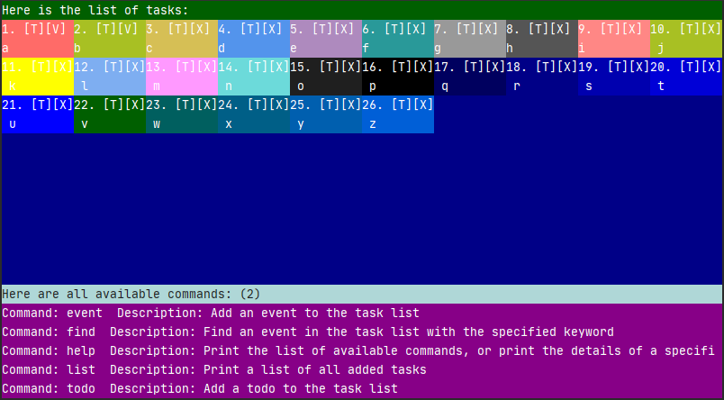
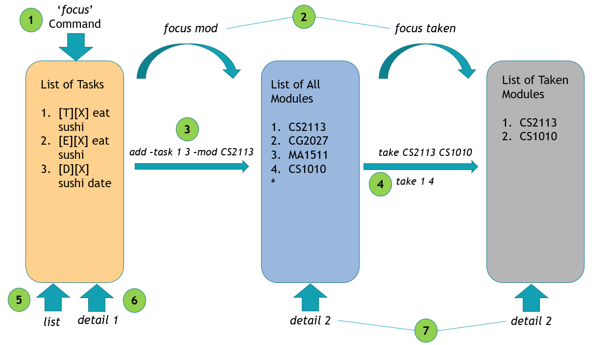
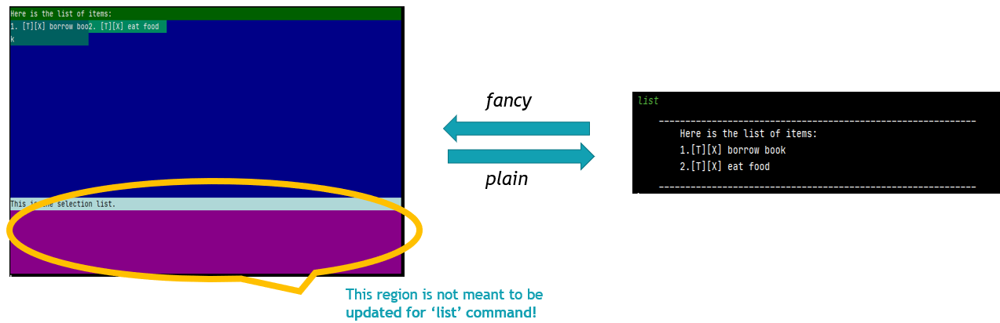
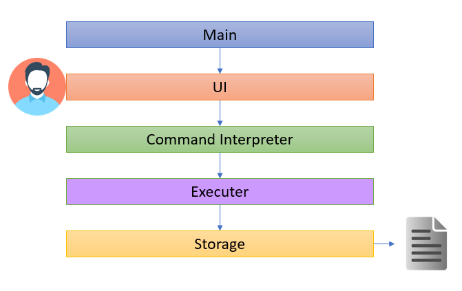
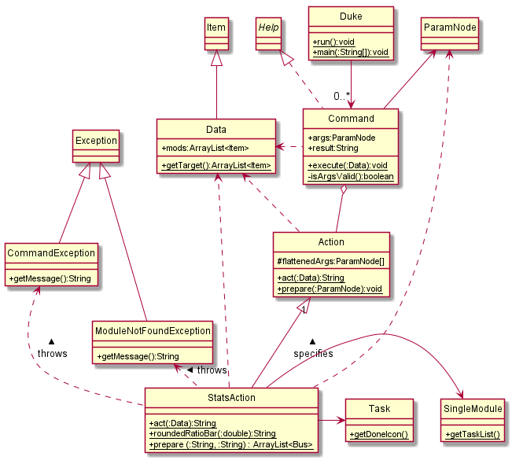
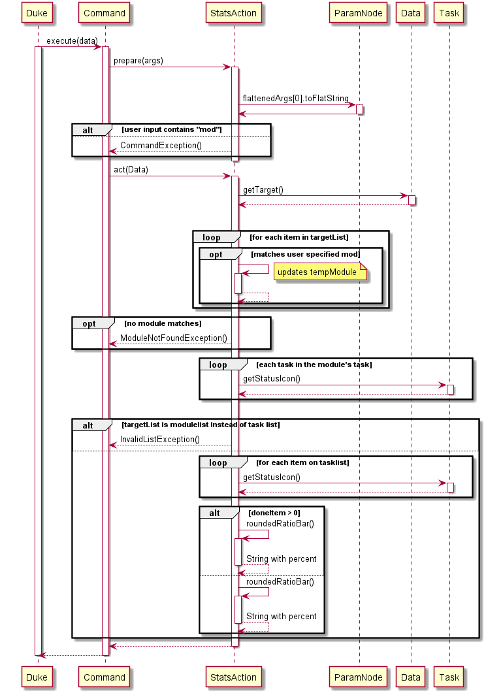

# Chan Jian Xiang - Project Portfolio Page


## 1. Overview
### 1.1 Project Overview 
DOMNUS - is a desktop application that helps in module and task tracking. It was developed under the module CS2113 Software Engineering & Object Oriented Programming. Within the schedule of approximately 7 weeks, my team of 5 Computer Engineering students successfully created DOMNUS to help students to stay organize with respective to the modules they take in NUS. 


This is what out product looks like: 


## 2. Summary of Contributions
Given below are my contributions to the project. 

### 2.1 Enhancements Implemented: 
**MC Feature**: Added the ability to list total number of MCs or the individual components that made up the MC based on the selected list.<br>
**What it does**: Allows the user to print the total number of MC based on the list that he/she is focusing on (i.e list of taken module). See the individual components that made up the total MC using this feature by typing `mc -d`<br>
**Justification**: This feature improves the product as user would want to keep track of his current taken module's MC so as to prevent overloading/under-loading of modules in the upcoming semester. <br>
**Highlights**: This enhancement works well with the existing CAP calculation feature, as it allows the aforementioned feature to make use of the total MC to do further mathematical calculation of the user's CAP. This aligns with the practice of code reusability. <br>

**Statistic Feature**: Added the ability to show the statistics of the number of task that have been completed. <br>
**What it does**: Allows users to track the current completion status of their tasks. <br>
**Justification**: Very often, students are not sure of how much task have been completed or how much are they left with for the week. This feature enables them to keep track of their weekly progress. <br>
**Highlights**:  This feature is capable of keeping track of individual module's task progress as well. This works in conjuncture with the ability to add individual task to the modules which allow user to better track his/her progress. <br>

**Recurrence Feature**: Added the ability to allow user to add Recurring Tasks.<br>
**What it does**: Allows user to add weekly recurring task such as a weekly meeting or weekly quiz. <br>
**Justification**: It is common to have a weekly meeting amongst the busy students schedule. This features enables the user to do so simply by adding `Weekly` at the end of a deadline or event command. Be it a weekly quiz or weekly CCA meeting, this helps users to quickly setup a weekly schedule. <br>
**Highlights**: The combination of this feature with the reminder feature done by the 2 other student Computer Engineer on our team, will enable the student using this app to plan ahead of his time for the upcoming schedule. Which is a key factor in productivity for the student. <br>

**Code Contributed**: 
[Reposense link](https://nus-cs2113-ay2021s1.github.io/tp-dashboard/#breakdown=true&search=scjx123&sort=groupTitle&sortWithin=title&since=2020-09-27&timeframe=commit&mergegroup=&groupSelect=groupByRepos&checkedFileTypes=docs~functional-code~test-code~other)

### 2.2 Contributions to UG: 
The following section shows my contribution to the DOMNUS User Guide. It includes: Domsun Tutorial, mc and stats. <br>
{start of extract}<br>
### Domsun Tutorial 
As a beginning, here is how Domsun works. It has 3 lists that you should take note of as shown below. (The lists shown are non-exhaustive, as there are other dynamic lists that are created based on the `focus` command. Do refer to `focus` section of this User Guide for more details). 


1. `focus` command focuses the app onto the list of tasks that you currently have. 
2. Likewise, `focus mod` focuses the app on the entire list of modules available in NUS, while `focus taken` is the list of taken modules of your choice. 
3. To add a task under a module, you may enter the command `add -task 1 3 -mod CS2113`. 1 and 3 here are indices of the tasks in the task list. So be sure to have some task added BEFORE typing this command. 
4. To mark a module as 'taken', you may enter `take CS2113 CS1010` while focusing on the module list by using `focus mod`. alternatively, you may use the indices method as before such as `take 1 4` to take the 1st and 2nd module available on the module list. 
5. The `list` commands follows the app's current focus. If it is focusing on list of tasks, typing `list` will show all tasks. Likewise for modules and taken. 
6. Typing `detail 1` when focusing on tasks list, will display the 1st index, task details. 
7. Note that `detail 2` here will display different results as the two indices of 2 represent different modules! The one on the left represents CG2027 while the one on the right represent CS1010. 

**A point to note before venturing into the libraries of commands that we have.**<br> 
- You can switch between fancy mode display, and plain display anytime during the program. 
During `list` command, you will be able to toggle between pages of fancy by using `prev` and `next`
However, the current version of fancy mode is still in beta, hence, it is expected to not be able to fully display certain commands that are too long. such as `help`, `detail`,`mc` etc. Do look forward to the next update!<br>
<br>
{end of extract} <br>
The Domsun tutorial section was a result of the peer feedback during the PE Dry run. As i realised the importance of building the intuition in user to know how the app actually works, i decided to bridge the learning gap by providing a pictorial guide for the user. <br>

Below shows the extract of the `mc` and `stats` section contributed by me in the User Guide. <br>
{start of extract} <br>
### `mc` - Prints MCs

Typing `mc` prints the number of MCs based on selected option. By default, this command focuses on the entire module list. In order to print the MC of taken modules, do remember to enter 'focus taken' before proceeding with this command. 

Syntax:

`mc [-option] [-detail]` <br>
`option: -d(detailed)`

Example of usage (when there are modules in the target): 

`mc`

Expected outcome:

   ```  
    ____________________________________________________________
    Here is the total MC:
    22
    ____________________________________________________________
   ```
Example of usage (when there are modules in the target): 

`mc -d`

Expected outcome:

   ```  
    ____________________________________________________________
    Here is the total MC:
    EE1001: 4MCs
    EE1001X: 4MCs
    EE1002: 4MCs
    EE1003: 4MCs
    EE1111: 6MCs
    ____________________________________________________________
   ```
### `stats` - Prints Statistics

Typing `stats` prints the percentage of the task completed.

Syntax:

`stats [-option] [-detail]` <br>
`option: -mod` <br>
`detail: [module code]`

Example of usage (when focused on task list, and no task is completed): 

`stats`

Expected outcome:

   ```  
    ____________________________________________________________
    Here are the statistics: 
    [0.0%]
    ____________________________________________________________
   ```
Example of usage (when checking specific modules, with all task completed): 

`stats -mod CS2113 `

Expected outcome:

   ```  
    ____________________________________________________________
    Here are the statistics: 
    [100.0%]
    ____________________________________________________________
   ```
{end of extract} 

### 2.3 Contributions to DG:
The following section shows my contribution to the DOMNUS Developer Guide. It includes: Introduction, Setting up, (Design) 4.1, 4.2, 4.5, 4.6, (Implementation) 5.2, Appendix A,B,C,D,E,F. <br>
{start of extract}
### 4.1 Architecture
The **Architecture Diagram** below represents a high-level design overview of the App. Specifically, it is done with an N-tier architectural style, where the higher layers make use of services provided by lower layers. 



As shown in the above diagram, the user only interacts with the UI layer and their commands, in turn, will be passed to the next adjacent layer. Given below is a quick overview of each component. 

**4.2 Main Layer**<br>
The `main` layer, it contains a single class known as `Domnus`. Its purpose can be split into 3 parts: 

At Start-Up: It calls upon the `storage` component to load the user's past data and it also loads the complete module list that is packaged inside the JAR file. <br>
At Operating: It connects the relevant component of the program to ensure the program is operating as per the intended logic flow. <br>
At Shutdown: It exits the running loop of the program to shut down the program successfully. <br>

**4.5 Execute Layer**<br>
The `Execute` layer carries out the relevant actions required based on the analyzed input. All of the features in the program are stored under this layer which is under the package name `command`. To summarize, this layer is responsible for: 

1) Match the user's command to the relevant actions.
2) Throw any exception based on erroneous user input/invalid conditions. 

**4.6 Storage Layer**<br>
The `Storage` layer loads, saves, and do pre-data processing before performing the two aforementioned action. It is active in 2 phases. 

During the loading phase: 
1) For the user's task: This layer translates the previously (if any) saved data format into recognizable commands and loads these data as per how the app functions during runtime. 
2) For the module list: This layer conducts simple parsing of the text file containing all the modules and stores them creates individual items known as `SingleModule` before loading them into an ArrayList. 

During the saving phase: 
1) For the user's task: This layer saves any changes that the user made to the task list onto a text file. 
2) For the module list: This layer saves any module marked `TAKEN` by the user onto a text file, together with the relevant module information such as module's code, and grade attained (if any).  

### 5.2 Statistic Feature 
The statistic feature is facilitated by the `StatsAction` class. It extends `Action` class, and it functions under the architectural component `execute`. Internally, it stores an arraylist of Item object in `targetList`. This class implements the following operation: 

 - `prepare()` - Sets `isMod` flag according to user's 
 - `act()`- Gets `targetList` and calculates the raw ratio of the completed items.
 - `roundedRatioBar()`- Returns a rounded ratio enclosed in square brackets for printing. <br>

The diagram below shows the various class associated with `StatsAction`


Given below is an example usage scenario and how the statistic mechanism behaves at each step. 

Step 1. The user enters `stats -mod CS2113`	once the execute layer executes the message and calls `action.prepare()` class, `StatsAction` will begin its `prepare()` operation

Step 2. `prepare()` looks at the input called `ParamNode args` which is user command processed by Command Interpreter layer, and starts to identify whether the user has entered the keyword `mod ` if `userInput` contains the keyword, then `isMod` flag will be set. 

Step 3. Next, execute layer will call `action.act()` which causes StatsAction to begin its `act()` operation. If `isMod` flag is set, `act()` will search for the user-specified module and get the list of tasks tagged to it.

Step 5. Once the list of tasks is obtained, the operation will loop through the task list and count the number of completed tasks followed by generating a ratio. 

Step 6. This ratio will be passed into `roundedRatioBar` to return *String* of a rounded ratio to 1 decimal place enclosing it in square brackets. 

Step 7. Now `StatsAction` is completed and it will return this string back to `Command` to store it under the String variable `result`. The `Main` layer will retrieve `result`, before passing it onto `UI` layer for printing. 



**Design consideration:**

**Aspect: How statistics executes**
 - **Alternative 1 (current choice):** Create a separate class and get list of tasks/taken modules' task and scan through them to calculate statistics
	 - Pros: Reduces Coupling and increase testability as a software unit itself. 
	 - Cons: May have performance issues in terms of memory usage 

 - **Alternative 2:** initialize statistics as zero and each task contains an aspect called statistics
	 - Pros: Will use less memory since the task itself will be deleted. 
	 - Cons: Stats will be updated constantly even though we do not need it. 
	 
## Appendix A. Product scope
### Target user profile

 - needs to manage a significant number of schedules 
 - prefer desktop apps over other types 
 - can type fast
 - prefers typing to mouse interactions 
 - is reasonably comfortable using CLI apps 

### Value proposition
All in one app to track tasks and their dates, monitor productivity, and calculate cap. 

## Appendix B. User Stories

|Priority| As a ... | I want to ... | So that I can ...|
|--------|----------|---------------|------------------|
| *** |Student before the start of semester|List the modules MC|Follow the recommended MC |
| *** |Student before the start of semester|List of module available|Easily Choose which modules to take|
| ** |Student before the start of semester|Find the modules either by keyword, module code, or even MC |Easily see the desired modules |
| ** |Student before the start of semester|Select the modules but not taking it yet |Easily whether the MC fits my requirement |
| *  |Student before the start of semester|Find out the details of the Module|To find out more about the modules.|
| *** |Student before the start of semester|Take the desired modules|Mark the modules that I want to take as taken  |
| *** |Student during the semester|Add tasks such as todo, deadline, and event into my list|Easily keep track of all the task I have to complete  |
| ** |Student during the semester|Have a Reminder of which deadline is due soon|Ensure that no task is missed out  |
| *** |Student during the semester|Add a task to modules |Easily know which tasks belong to which modules  |
| *** |Student during the semester|Delete task once they are completed |Remove unnecessary task on the list |
| ** |Student after the semester|Calculate the CAP of my modules|Easily find out my performance this semester |
| * |Student after the semester|Clear the list of tasks and modules|Start afresh for the next semester |

{More to be added}
## Appendix C. Use Cases: 
This section describes the Use Cases for some of the features implemented in DOMNUS. 

**Use Case: Taking a module 
MSS:** 

 1. User requests to list all modules 
 2. DOMNUS shows a list of modules 
 3. User requests to mark a specific module as 'taken' 
 4. DOMNUS marks the module as taken

Use case ends.<br>
**Extensions** \
&nbsp;&nbsp;&nbsp;3a. The module given is invalid\
&nbsp;&nbsp;&nbsp;&nbsp;&nbsp;3a.1Use case shows `[NOT FOUND]` message
&nbsp;&nbsp;&nbsp;&nbsp;&nbsp;Use case resumes at step 3\
&nbsp;&nbsp;&nbsp;3b. User adds in the wrong module \
&nbsp;&nbsp;&nbsp;&nbsp;&nbsp;3b.1The `untake` command can be used to untake the taken module

**Use Case: List MC**
**MSS:**


 1. User requests to list total MC on the current list.
 2. DOMNUS shows the total MC of the current list. The default list is the entire modules list.

Use case ends.<br> 
**Extensions** 

&nbsp;&nbsp;&nbsp;1a. User not focusing on the correct list \
&nbsp;&nbsp;&nbsp;&nbsp;&nbsp;1a1. DOMNUS shows the entire module list total MC instead of the 'taken' list MC


## Appendix D. Non-Functional Requirements

1.  Should work on any  _mainstream OS_  as long as it has Java  `11`  or above installed.
2.  Should be able to hold up to 1000 persons without a noticeable sluggishness in performance for typical usage.
3.  A user with above-average typing speed for regular English text (i.e. not code, not system admin commands) should be able to accomplish most of the tasks faster using commands than using the mouse.

_{More to be added}_

## Appendix E. Glossary

 - N-tier Architectural Style 
	 - In the n-tier style, high layers make use of services provided by lower layers. Lower layers are independent of higher layers. 
 - Mainstream OS: Windows, Linux, Unix, OS-X
 - Private contact detail 

## Appendix F. Instructions for manual testing

1. Launch and Shutdown 
Step 1: Download the latest version of  `DOMNUS`  from  [Our Release Page](https://github.com/AY2021S1-CS2113-T13-2/tp/releases/tag/v1.0).\
Step 2: Copy the file to the folder you want to use as the home folder for your Mobile Nusmod.\
Step 3: Open the Command Prompt if you are running on Windows or Terminal if you are running on Mac OS.\
Step 4: Navigate to your home folder and type  **‘java -jar domnus.jar’**

2. Switching between Fancy and CLI 
Test case: `fancy`<br>
Expected: Switches to fancy mode of display <br>
Test case: `plain`<br>
Expected: Switches to plain mode of display<br>
Test case: `Fancy` ,`Plain`<br>
Expected: Error message due to cap sensitive. <br>
3. Focusing on a different list
Test case: `focus mod`/`task`/`todo`/`deadline`/`event`/`selected`/`taken`<br>
           Expected: Shows the current list you are focused on. No list will be shown. <br>
Test case: `focus taken` <br>
Expected: Shows the current list of modules you have taken. <br>
Other incorrect focus commands to try: `focus 0` , `focus what?`, ... (focus on non-existent list) <br>
Expected: Error message due to invalid command. <br>
	
4. List Modules/Task
Test case: `focus mod` -> `list`<br>
Expected: Shows the list of modules. <br>
Test case: `focus task` -> `list` <br>
Expected: Shows the current list of tasks. <br>
	
5. Find Modules 
Test case: `focus mod` -> `find Engin`<br>
Expected: Shows the list of available modules with keyword 'Engin' <br>
Test case:  `focus mod` -> `find 2113`<br>
Expected: Shows the list of modules with keyword '2113'<br>
Test case: `focus task`-> find deadline <br>
Expected: Show list of deadline modules 

6. Details of Modules 
Test cases: `detail CS2113`<br>
Expected: Shows Module code, name, mc, and description. <br>
Test cases: `detail 1`<br>
Expected: Shows the information of the 1st task based on the current list focused on. <br>
Test cases: `detail xyz` No detail of such item is found. <br>

7. Take Modules 
Test cases: `focus mod` -> `take 1 2` <br>
Expected: Takes the 1st and 2nd module on the module list.<br>
Test cases: `focus task` -> `take 1 2` <br>
Expected: Task is not module, therefore it cannot be taken.<br>
Test cases: `focus mod` -> `take CS2113` <br>
Expected: Mark CS2113 as taken.<br>
Test cases: `focus mod` -> `take cs2113`<br>
Expected: Module not found as inputs are case sensitive. <br>

8. Reminder <br>
Test cases: `reminder `<br>
Expected: Shows tasks that are due within 3 days. <br>

9. Cap Calculation <br>
Test cases: `cap`<br>
Expected: Shows you the calculated cap from stored user data. <br>
Test cases: `cap -m CS2113 A+ EE2026 B CS1010 B-`<br>
Expected: Shows you the calculated cap from given input modules. <br>

{End of extract} 

### 2.4 Contributions to team-based tasks: 
1. Retrieved a complete list of Module Data that includes its relevant details such as Module Code, MC, Prerequisites, etc. 
2. Wrote the ModuleParser code for (which was really taxing amount of data to sieve through due to incompatible formatting from excel into text file).
3. For UG: Wrote the 'Domnus Tutorial' section 
4. For DG: Wrote the Introduction, Setting up, (Design) 4.1, 4.2, 4.5, 4.6, Appendix A,B,C,D,E,F
5. Planned and recorded the first and second video demo. 
